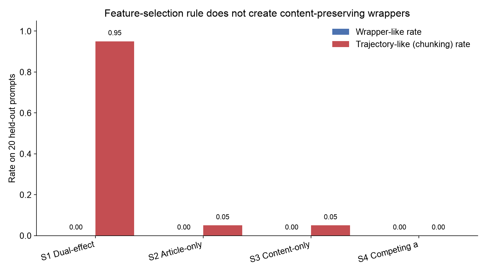
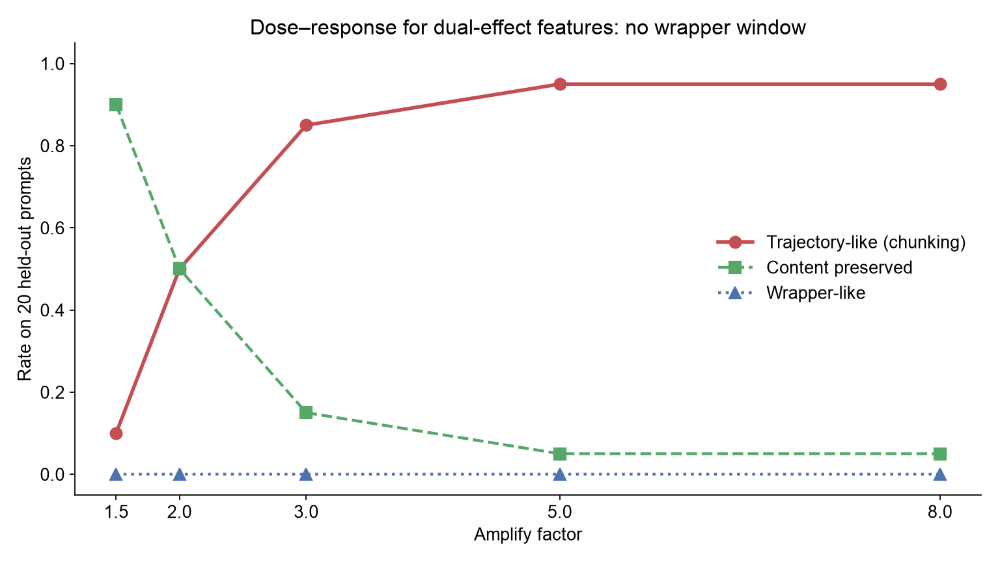
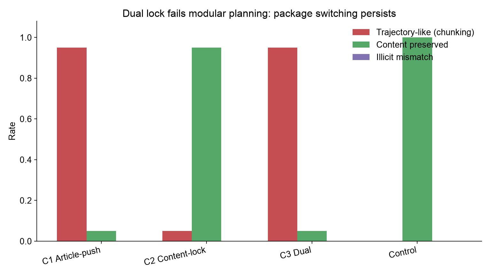
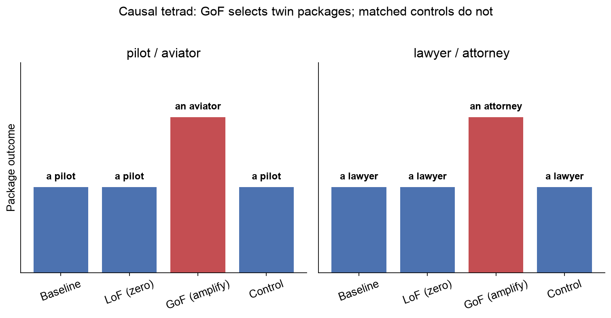
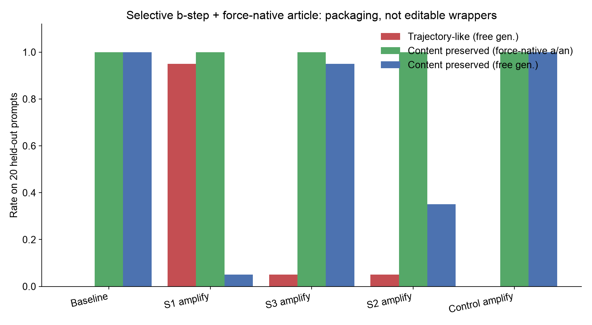
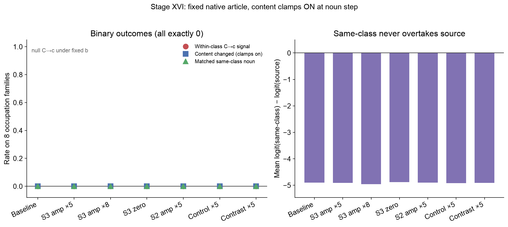
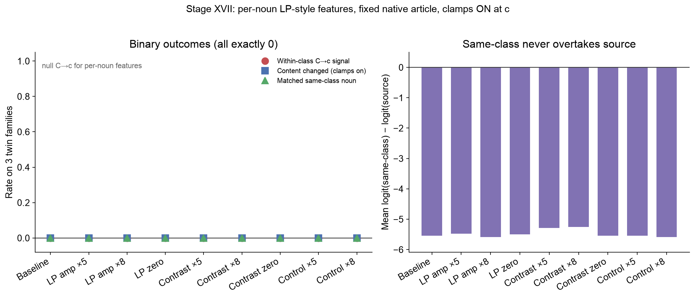

From "Stalling" to Coordinated Preparation--Content Control in Gemma 3
270M

# Summary

This project began with a practical question: can a small language
model's tendency to emit a bridge or "stall" token be causally reduced,
allowing it to commit earlier to an answer it already represents? We
used Gemma 3 270M because it can be studied on a 16 GB Apple M1 with
Circuit Tracer. Our standard was deliberately high. Moving one desired
output logit on one prompt would only validate the intervention tool. A
meaningful result would require a reusable intervention that transfers
across prompts without injecting a specific answer or broadly damaging
language behavior.

The work proceeded in three phases.

First, country--city prompts tested the original stalling idea. On The
city people most strongly associate with France is, Gemma ranked the
first and Paris second. Interventions could reverse that ordering, but
the effect was not clean: direct suppression of features supporting the
failed on the source prompt, successful combinations included
Paris-associated features, and related interventions moved wrong-country
answers and syntax controls. Shared suppression features later produced
small cross-country movements, but no combination met the specificity
standard. This phase validated the mechanics of feature intervention and
exposed the central confound: changing an output token is not the same
as isolating a reusable "commitment" mechanism.

Second, we adopted the preparation--content task from *Latent Planning
Emerges with Scale*. That paper asks whether a model represents a future
content word early enough to choose a preceding grammatical token such
as a versus an. Gemma strongly favored the majority article a. On the
key prompt Someone who treats eye diseases is, it generated the
ungrammatical continuation a ophthalmologist. Circuit tracing showed
that features carrying information about the future word ophthalmologist
were active before article generation. More importantly, suppressing a
separately selected pair of features changed the continuation to an
ophthalmologist on the source prompt.

The decisive held-out test changed the interpretation. The same fixed
pair repaired 10 expected-an cases, but it also changed 22 expected-a
controls to an and changed the first content word on 37 of 107 held-out
prompts. Examples included a pilot becoming an aviator, and a lawyer
becoming an attorney. There were zero cases where the article alone
repaired a realized grammatical mismatch while the content word remained
fixed. The intervention therefore did not behave like a clean grammar or
anti-stalling control. It behaved like a switch between coordinated
response classes—compiled trajectories (chunks): a plus a
consonant-initial noun versus an plus a vowel-initial noun.

Third, after Stage VII we planned mainly to *confirm* that chunking
story with twin occupations and controls. Collaborator discussion then
raised the bar using an explicit causal graph (Section 10.2): *Latent
Planning* requires separable forward and backward planning
(\(A \rightarrow C \rightarrow B\) with \(C \rightarrow c\)), but
autoregression also gives \(b \rightarrow c\). Article movement under
sparse intervention is only secure as modular planning if content
identity can be locked—and if noun changes survive **holding \(b\)
fixed**. We therefore ran a stricter causal program on pretrained Gemma 3
270M with an affine Gemma Scope 2 transcoder (chosen over
instruction-tuned + non-affine after comparing the two stacks; see
Section 10). Across selection-criterion ablation, dose–response, forced
content-lock / dual intervention, a causal tetrad on twin families,
slim domain transfer, a **selective article-step intervention with
pasted native article**, and a **corrected fixed-\(b\) within-class
\(C \rightarrow c\) assay** (content clamps kept **on** at the noun step),
**no held-out condition produced reliable wrapper-like repair**.
Dual-effect gain-of-function remained trajectory-like
(chunking)—for example amplifying frozen features turned
`Someone who flies airplanes is` from `a pilot` into `an aviator` when
generation was free, yet pasting the native article `a` restored
`pilot`. Content-only features did not provide a selective licensing
handle, and under fixed native \(b\) they also failed to move nouns
among same-article-class alternatives (`pilot`↔`captain`, …). Illicit
mismatches such as `an` + consonant-initial nouns stayed near zero.

Our current claim is therefore:

> *In Gemma 3 270M (pretrained), sparse features that look like
> “planning” features under article-only metrics behave as packaged
> \(\{B,C\}\) controls (Hypothesis H2), not as an editable modular graph
> (Hypothesis H1). With these intervenable features we cannot demonstrate
> independent \(C \rightarrow c\) once \(b\) is held fixed—including on
> within-class noun targets under a corrected content-on-at-\(c\)
> protocol, and including Latent-Planning-style per-noun feature
> selection (Stage XVII); free noun change tracks \(b \rightarrow c\).
> That is strong evidence these mechanisms are not modular latent
> planning and that article-conditioned packaging (or strong
> \(b \rightarrow c\)) dominates execution—without yet being a refutation
> of every \(C \rightarrow c\) somewhere in the network (Section 11).*

The novelty is the juxtaposition, not a blanket “no content
causation” claim. The same editable sparse space that *successfully*
switches legal packages under free generation (`a pilot` ↔ `an aviator`)
still yields a stubborn null for **independent** \(C \rightarrow c\)
under fixed \(b\). Packaging and \(b \rightarrow c\) are easy to move;
modular content control is not—in every representation we could
actually manipulate (dual-effect, content-ish, hint-contrast, and
per-noun LP-style features). Residual / dense directions remain an open
fairness check (Section 11), not a result we claim to have closed.

This is a publishable *mechanistic* claim relative to the Latent Planning
task family on this model, not a claim about all scales or all
architectures. The early stages remain the path by which the claim was
earned: stalling failed specificity; ophthalmologist looked like planning
on one prompt; held-out transfer forced the chunking reading; the later
causal suite stress-tested that reading against a modular alternative.


# A plain-language guide to the methods

This report uses several terms from language modeling and mechanistic
interpretability:

- **Token:** a unit of text processed or generated by the model. A token
  may be a whole word, such as Paris, or part of a word, such as
  ophthalm.

- **Next-token prediction:** given all text so far, the model assigns a
  score to every token that could come next. Generation normally selects
  or samples from this distribution, then repeats the process.

- **Logit:** the model's unnormalized score for a possible next token.
  A larger logit means a token is favored more strongly. Probabilities
  are obtained by applying a softmax transformation to all logits.

- **Logit margin:** the difference between two logits. For example,
  Paris - the is positive when Paris is favored over the and negative
  when the is favored.

- **Baseline:** the model's logits or generated continuation with no
  internal intervention. Every intervention result is interpreted
  relative to this unchanged run.

- **Transcoder:** the auxiliary sparse model used by Circuit Tracer to
  decompose the original neural-network activation at each layer into
  individually addressable features plus reconstruction error. The
  transcoder does not replace Gemma; it provides the feature coordinates
  used for attribution and intervention.

- **Feature:** Circuit Tracer represents activity inside a model layer
  using learned sparse components. A feature is one such component. A
  label such as L13/F10304 means feature 10,304 in the transcoder
  attached to model layer 13. A feature is not assumed to have one
  human-readable meaning merely because it affects a token.

- **Attribution graph:** a directed graph estimating how input tokens,
  internal features, and error terms contribute to later features and
  output logits for one model run. It suggests candidate causal
  pathways, but attribution alone does not establish causality.

- **Intervention:** a second forward pass in which selected internal
  feature activations are deliberately changed. In this project,
  **suppression** sets an activation to zero. We then compare the
  intervened logits or generated continuation with the unchanged
  baseline.

- **Final prompt position:** the internal state produced after the model
  reads the last token of the prompt and immediately before it predicts
  the next token. Intervening there changes the computation used to
  select that next token.

- **Demonstration:** a completed example placed before the target prompt
  to show the desired task format. The model weights are not updated;
  this is one-shot prompting.

- **Held-out prompt:** a prompt that was not used to discover or select
  the intervention. Held-out evaluation tests whether one fixed
  intervention transfers rather than being tailored to its source
  example.

- **Preselected criterion or intervention:** a rule or feature
  combination fixed before examining the final aggregate test result.
  This reduces the risk of presenting whichever choice happened to work
  by chance.


- **Wrapper-like effect / editable wrapper:** an intervention that
  changes the preparatory article while preserving the later content
  word (or its planned identity). This is what a content-preserving
  latent-planning repair would look like—an editable “wrapper” around a
  fixed latent noun.

- **Trajectory-like / compiled-trajectory effect (chunking):** an
  intervention that switches a coordinated multi-token package—typically
  article plus noun-initial sound class—together (for example `a pilot`
  to `an aviator`). In this report we use “compiled trajectory,”
  “response class,” “chunk,” and “package” as near-synonyms for that
  structure. A **packager** mechanism is one that implements such fused
  packages rather than separately editable preparation and content.

- **Latent Planning modular graph (Hypothesis H1):** for tokens
  \(a\) (prompt-final context), \(b\) (article), \(c\) (noun) and
  corresponding concepts \(A\), \(B\), \(C\),

```text
a → A → C → B → b
         ↘     ↓
           ──→ c
```

  \(A \rightarrow C\) is **forward planning** (context builds a content
  plan). \(C \rightarrow B\) is **backward planning** / licensing (the
  plan chooses the article). \(C \rightarrow c\) says the same plan
  drives the noun. \(B \rightarrow b\) and \(b \rightarrow c\) are
  ordinary feature→token and autoregressive edges. Token order is
  \(a,b,c\); planning order puts \(C\) before \(B\).

- **Packager / compiled-trajectory graph (Hypothesis H2):** article and
  noun-class are one fused object rather than separable \(C\) and \(B\):

```text
a → A → {B, C}_bundle → (b, c)
              ↑
         (b also feeds c)
```

- **Native \(B\)/\(C\) or native \(b\)/\(c\):** the feature activations or
  tokens that appear with **no** intervention.

- **Turned up / turned down:** amplifying or zeroing a chosen feature
  set (\(A\), \(B\), \(C\), or a joint set such as S1).

- **Selective \(b\)-step intervention (Stage XV schedule):** clamp
  selected features on the forward pass that predicts the article
  \(b\), then turn the clamp **off** before predicting the noun \(c\).
  Good for demonstrating \(b \rightarrow c\) under free vs force-native
  generation; **not** a fair negative test of \(C \rightarrow c\) by
  itself, because content clamps are absent at the noun step.

- **Paste native article (force-native \(b\)):** after the intervened
  \(b\)-step, insert the article token the *unintervened* model would
  have produced, then continue. This holds the \(b \rightarrow c\) edge
  fixed at its native value so a changed noun cannot be blamed merely on
  having emitted `an` instead of `a` (or vice versa).

- **Fixed \(b\), content-on-at-\(c\) (Stage XVI schedule):** paste native
  \(b\), but keep content-feature clamps **active** at the original
  pre-article planning position while predicting \(c\) (full-sequence
  recompute). The fair assay for independent \(C \rightarrow c\),
  especially with **within-class** noun targets (e.g. `pilot`↔`captain`
  under fixed `a`).

- **Gain-of-function (amplify):** raising a feature’s activation above
  its natural value on a prompt, used to test sufficiency.

- **Loss-of-function (zero / suppress):** setting a feature’s activation
  to zero, used to test necessity.

- **Illicit mismatch:** a generated article–noun pair that violates
  English indefinite-article phonology (for example `an pilot` or `a
  aviator`). Near-zero illicit rates under strong article interventions
  suggest the model prefers legal packages over grammar-only edits.

Whenever this report says that a token was "predicted," it means that
the token had the highest next-token logit unless stated otherwise.
Whenever it says that behavior "changed," it refers to a comparison
between the unchanged baseline run and a run with the specified feature
activations suppressed (or amplified).

# 1. Research question and standard of evidence

Autoregressive language models generate one token at a time, but
coherent language often requires information about words that have not
yet been emitted. An article is a simple example: choosing a or an
depends on the sound at the beginning of the next noun. A model can
solve this either by representing the future noun before selecting the
article, or by selecting the article first and allowing that choice to
constrain the noun.

Our initial "stalling" hypothesis was broader. We proposed that small
models may possess answer-relevant representations that are partially
concealed by circuits favoring generic bridge tokens such as the. If
those circuits could be down-regulated, the model might commit directly
to the contextually appropriate answer.

We required three properties before treating an intervention as
scientifically meaningful:

- **Causality:** changing the feature must change model behavior.

- **Transfer:** a fixed intervention must work on prompts not used to
  select it.

- **Specificity:** it must improve the intended behavior without
  injecting a particular answer, changing unrelated prompts, or merely
  exchanging one coherent answer for another.

The third requirement is crucial. If a "Paris" feature raises Paris for
both France and Germany prompts, the intervention controls content but
does not reveal a general commitment mechanism. Likewise, if an article
intervention changes both a pilot and an aviator, it may be controlling
a larger response class rather than repairing preparation for a fixed
answer.

# 2. Stage I: Can a high-probability bridge token be suppressed?

## Motivation

The first experiments established whether Circuit Tracer could identify
and causally manipulate features contributing to competing next-token
outputs. The source example was:

The city people most strongly associate with France is

Gemma's top two next-token candidates were:

| Rank | Token | Probability | Logit |
| --- | --- | ---: | ---: |
| 1 | the | 0.248 | 18.743 |
| 2 | Paris | 0.186 | 18.458 |

The baseline commitment margin was:


$$
m = \ell_{\mathrm{Paris}} - \ell_{\mathrm{the}} = -0.284
$$


Because Paris was already strongly available, the was treated as a
possible bridge into a longer phrase such as "the city of Paris." The
experiment asked whether suppressing features that positively
contributed to the would allow Paris to win.

## Experiment and result

We built attribution graphs for the and Paris, then tested three
intervention families at the final prompt position:

- suppress features supporting the;

- amplify features supporting Paris;

- combine both operations.

For each family, candidates were selected from features with positive
attribution to the relevant output token in the source graph. "Top
eight" therefore means the eight highest-ranked candidate features under
that graph-based selection rule, not eight features chosen after
observing which intervention worked. For every intervention, we reran
the same prompt, recorded the new Paris and the logits, and subtracted
the baseline values. This produced the reported change in each logit and
in the Paris - the margin.

The best combination changed the margin by +1.175, making Paris rank
first. Most of this movement came from reducing the the logit by 1.340,
while the Paris logit itself fell slightly by 0.166.

This demonstrated causal control of the output competition, but not the
hypothesized mechanism. Pure suppression of the-supporting features did
not work: suppressing the top eight made the margin worse by 0.672. The
successful intervention also used Paris-associated features, creating an
obvious answer-injection confound.

## Why the next stage was necessary

An intervention selected on France and evaluated only on France cannot
distinguish a reusable commitment feature from a Paris-specific feature
or a broad change in answer format. We therefore moved to multiple
countries and explicit controls.

# 3. Stage II: Cross-country transfer and the specificity problem

## Motivation

The next experiments used prompts for France, Germany, Spain, and Italy,
with expected answers such as Paris, Berlin, Madrid, and Rome. Prompt
families included direct capitals, near matches, and country-specific
association prompts. We compared each expected city with the competing
token the.

The core test was asymmetric:

- A useful commitment intervention should increase the correct city
  relative to the across countries.

- A Paris-inducing intervention should fail because it would also raise
  Paris on Germany, Spain, or Italy prompts.

- A broad syntax intervention should fail because it would move
  non-geographic controls.

## Experiment and result

Country-specific interventions often produced strong movement on the
prompt used to select them. When transferred, however, they also
produced wrong-city movement. This "cross-country pollution" prevented
the strong claim that the features were disentangled from city
semantics.

"Wrong-city movement" means that an intervention increased, or
insufficiently separated itself from, the logit of a city that was not
the correct answer for that prompt. For example, a France-derived
intervention that favors Paris on a Germany prompt is not evidence of
general commitment, even if it also lowers the.

We then searched for feature identifiers appearing among the
the-supporting candidates in attribution graphs from multiple countries.
Two individual candidates, L7/F89 and L10/F9037, showed weak directional
promise when suppressed. Each was first tested alone. We then suppressed
both activations in the same forward pass to test whether their effects
combined. This pair experiment did not mean that one feature was applied
to France and the other to Germany; the identical pair was applied to
every evaluated prompt.

The pair was interesting because it was fixed across cases and used
suppression only. Nevertheless, the aggregate result did not meet the
success criteria set before reviewing the combined results: effects were
small or inconsistent, some expected-city logits fell, wrong-city logits
moved, and syntax controls were not cleanly separated. The country stage
therefore ended as a negative mechanistic result.

## What this stage established

It established a reusable experimental discipline:


$$
\text{specificity} = \Delta \ell_{\mathrm{expected}} - \max(\Delta \ell_{\mathrm{wrong\ answer}}
$$
#0)

A next-token margin can improve even when the expected answer becomes
less likely, provided the competitor falls faster. We therefore stopped
treating margin improvement alone as evidence of useful commitment. This
lesson directly shaped the later held-out tests.

# 4. Connection to *Latent Planning Emerges with Scale*

## The nearest experiment in the paper

*Latent Planning Emerges with Scale* studies cases where an earlier
"preparatory" token depends on later content. Its a/an occupation task
uses prompts of the form:

Someone who treats eye diseases is

The model must choose an article before emitting an occupation. If it
plans ophthalmologist, the grammatically appropriate preparation is an.

The paper reports that latent planning becomes more evident with scale:
larger models more reliably encode and use future-content information
when selecting earlier functional tokens, while smaller models often
default to a majority-class preparation. The paper's core mechanistic
question is whether future content is represented before it is generated
and whether that representation contributes to the preparatory token.

## Our extension

Our hardware prevents a scale study, but Circuit Tracer gives us a
complementary causal question on one small model:

> *When a small model represents the future answer but nevertheless
> emits the wrong preparation, is the plan absent, ignored, or
> overridden by another pathway that can be causally suppressed?*

This contrasts with a simple scale conclusion. Rather than asking only
whether planning strength increases with model size, we ask whether an
apparently unsuccessful small-model plan can be exposed by intervention.

# 5. Stage III: Behavioral replication of the article imbalance

## Motivation

Before tracing circuits, we needed to verify that Gemma 3 270M occupies
a behaviorally relevant regime. If it always used correct grammar, there
would be no failure to explain. If it selected a but then changed to a
consonant-initial noun, the behavior could reflect coherent article-led
generation rather than a concealed plan.

Each target was evaluated after two one-shot demonstrations:

- a demonstration: Someone who studies living organisms is a biologist.

- an demonstration: Someone who studies ancient objects and sites is an
  archaeologist.

For example:

Someone who studies living organisms is a biologist. Someone who handles
financial records is

and

Someone who studies ancient objects and sites is an archaeologist.
Someone who handles financial records is

The immediate next-token probabilities of a and an were measured.

## Result

The pilot contained 32 target prompts: 20 whose listed occupation
required a and 12 whose listed occupation required an. Every target was
run twice, once after each demonstration. This produced 20 × 2 = 40
expected-a evaluations and 12 × 2 = 24 expected-an evaluations.

Here **article recall** means:


$$
\text{article recall} = \frac{\text{number of evaluations where the highest-logit article was the expected article}}{\text{number of evaluations requiring that article}}
$$


For all 40 expected-a evaluations, a had the higher next-token logit, so
expected-a recall was 40/40, or 100%. For only 3 of the 24 expected-an
evaluations, an had the higher logit, so expected-an recall was 3/24, or
12.5%. No third token outranked both articles in these evaluations.

Separating the expected-an cases by preceding demonstration shows that
the example had only a modest effect. After the a demonstration, an won
1 of 12 cases, or 8.3%. After the an demonstration, it won 2 of 12, or
16.7%. Gemma therefore showed a substantial majority-class bias,
although not complete collapse.


This was only a behavioral prerequisite. It did not show that Gemma
intended the listed word. For example, after Someone who handles
financial records is, Gemma generated a financial analyst, not a
accountant. The article and chosen noun were grammatically coherent.

## Why continuation screening was necessary

To motivate a concealed-plan analysis, we needed cases where the model
selected the wrong article and nevertheless continued with a
vowel-initial noun. We therefore generated the continuation rather than
inferring the future answer from the dataset label.

# 6. Stage IV: Finding genuine preparation--content mismatches

## Pilot continuation result

Across 24 expected-an pilot evaluations, only one unique target produced
a mismatch under both demonstrations:

| Prompt | Demonstration | Generated continuation |
| --- | --- | --- |
| Someone who examines eyes and prescribes corrective lenses is | a example | a ophthalmologist. |
| same prompt | an example | a ophthalmologist. |

The model did not generate the listed target optometrist; it generated
the semantically appropriate alternative ophthalmologist. This
distinction matters. The future content used for mechanistic analysis
must be the model's actual continuation, not the dataset's expected
label.

A **mismatch** was counted only when the model's own generated article
was a and the first generated lexical word began with a vowel sound,
making the realized phrase ungrammatical. Merely predicting a for a
dataset row labeled with a vowel-initial occupation did not count if the
model then chose a different, consonant-initial occupation. For example,
a financial analyst is grammatical and was not counted as a mismatch
even when the dataset listed accountant.

## Full released-dataset screen

We then screened all 105 an targets from the paper's released
a_an_examples.csv, evaluating each after both demonstrations. This
produced 105 × 2 = 210 evaluations. In 46 of those 210 evaluations, an
had the higher next-token logit, giving an recall of 46/210, or 21.9%.
We generated a continuation for every case rather than stopping at the
article. We found three mismatch rows representing two unique targets:

- Someone who treats eye diseases is → a ophthalmologist. under both
  demonstrations;

- Someone who studies stars and planets is → a astronomer. under the an
  demonstration.

Before running the full screen, we set a threshold of ten distinct
mismatch concepts as the minimum needed to justify a broad multi-example
mechanistic study. The two observed concepts fell below that threshold.
The scarcity is itself important: Gemma usually preserves grammatical
coherence by changing the noun after choosing a. We therefore narrowed
the mechanistic pilot to the reproducible ophthalmologist case instead
of generalizing from a large behavioral set that did not exist.

# 7. Stage V: Does future-answer information exist before the wrong article?

## Motivation

The string a ophthalmologist does not by itself prove planning. The
model might select a first and only later choose ophthalmologist. To
establish a latent plan, information associated with the future content
must be present before article generation and must causally contribute
to both the article decision and the eventual noun. In this report,
"future-answer information" therefore does not mean that a feature has
been given the semantic label "ophthalmologist." It means that the
feature is active before the article and has measured attribution to the
later ophthalm output, followed by a causal suppression test.

The mechanistic prompt was:

Someone who studies living organisms is a biologist. Someone who treats
eye diseases is

At baseline, the article logits were:


$$
\ell_{\mathrm{an}} - \ell_{\mathrm{a}} = -1.000
$$


After forcing a, the token ophthalm was the top continuation, with
probability 0.1459. "Forcing a" means appending the token a to the
prompt regardless of which article the model preferred, then measuring
the distribution for the following token. This lets us ask what content
the model would emit along the observed a branch.

## Experiment

We first built an attribution graph ending at the article decision and
identified features active at the final prompt position. We also
evaluated their relationship to the later ophthalm token. We screened
for features that contributed to:

- the future token ophthalm;

- the preparatory article logits;

- the eventual ophthalm token after the article.

For each candidate, suppression set that one activation to zero at the
final prompt position while leaving all other feature activations
unchanged. We then recomputed the article logits. In a corresponding
continuation run, we measured the effect on ophthalm after the article.
Comparing these runs with baseline tests whether the candidate is
causally relevant; the attribution graph alone only nominated the
candidate.

## Result

Four features showed a **dual effect**: when each feature was suppressed
independently, both the losing an preparation and the future ophthalm
token became less favored. The strongest, L13/F10231, changed the an
logit by −1.125 and the ophthalm logit by −0.250, while leaving the a
logit unchanged. Negative values mean that suppression lowered the named
token's logit relative to its unchanged baseline.

This is evidence that future-answer information was present before
article generation and contributed to the correct article pathway, even
though that pathway lost at baseline. It supports the "latent plan
exists" premise. It does not improve behavior; suppressing this feature
makes the correct preparation weaker.

## Next we needed to suppress the competing pathway

To correct behavior, we needed features supporting the competing
incorrect pathway rather than features carrying the future answer. We
therefore selected features that favored a over an but had low direct
attribution to ophthalm. This separation was designed to avoid simply
suppressing the answer itself.

# 8. Stage VI: Correcting the source prompt by suppressing a competing pathway

## Experiment

Candidate features were ranked by how strongly the attribution graph
indicated that they favored the incorrect article a over an. We excluded
candidates with a large direct attribution to ophthalm, because
suppressing such a feature could simply erase the answer. No
future-answer feature was amplified. The strongest remaining individual
candidate was L13/F10304.

Suppressing L13/F10304 alone improved the article margin from −1.000 to
−0.125: a still won, but only narrowly. We then tested combinations
selected from the five strongest screened candidates. The key
preselected two-feature intervention combined L13/F10304 with L14/F1949.
"Suppressing the pair" means setting both feature activations to zero
simultaneously in the same forward pass. Suppressing both:

- reduced the a logit by 0.125;

- increased the an logit by 1.000;

- improved the margin by 1.125, from −1.000 to +0.125;

- left the ophthalm logit unchanged;

- changed greedy generation from a ophthalmologist. to an
  ophthalmologist.


This was **the strongest source-prompt result in the project**. It
matched the expected signature of removing a competing grammatical
pathway while preserving the represented future answer. However,
selection and evaluation on one prompt cannot establish that
interpretation.

# 9. Stage VII: The held-out test that changed the hypothesis

## Motivation

The decisive question was whether the exact same intervention could be
handed to another researcher and applied without rediscovering features
for each prompt. We froze the pair L13/F10304 + L14/F1949, excluded the
source ophthalmologist sentence, and applied it at the final prompt
position to 107 other occupation prompts from the released dataset.
There was no per-prompt feature selection or adjustment after seeing an
output. Of these held-out prompts, 21 had listed answers requiring an,
while 86 required a.

The intended result was content-preserving transfer:


$$
\text{wrong article + same noun} \rightarrow \text{correct article + same noun}
$$


Expected-a prompts served as controls. A clean anti-stalling or grammar
intervention should not broadly turn them into an responses.

## Result

For this table, an expected-an **repair** means that the generated
article changed from baseline a to intervened an. An expected-a
**control change** means that a prompt whose baseline generated article
was a generated an after intervention. A **content-word change** means
that the first lexical word after the article differed between baseline
and intervention. A **grammar-only repair** requires the article to
become grammatical while that content word remains unchanged.

The fixed pair caused:

| Outcome | Count |
| --- | ---: |
| Expected-an prompts repaired | 10 |
| Expected-an regressions | 0 |
| Expected-a controls changed to generated an | 22 |
| First content word changed | 37 |
| Realized grammar-only repairs with content preserved | 0 |


Concrete examples make the mechanism clearer:

| Prompt meaning | Baseline | Fixed-pair suppression |
| --- | --- | --- |
| flies airplanes | a pilot | an aviator |
| represents clients in legal matters | a lawyer | an attorney |
| studies matter and energy | a physicist | an astronomer |

The 10 expected-an repairs are therefore not sufficient evidence of
success. The same intervention changed 22 of 86 expected-a controls to
an, and it changed the first content word in 37 of all 107 prompts.
These outputs remain locally grammatical because article and noun move
together. The intervention does not simply raise an; it shifts the
lexical continuation toward a vowel-initial alternative compatible with
an. Exact listed-word completions, meaning continuations whose first
content word matched the occupation supplied by the dataset, fell from
53 before intervention to 44 after intervention.

## Interpretation - we found an <'an'-noun> feature pair

The source correction was real, but its original interpretation did not
generalize. We did not isolate a feature pair that reveals a fixed
hidden answer by suppressing grammar or stalling. We found a pair that
causally influences a coordinated preparation--content choice.

There are alternative interpretations: we tried to find an
'an'-article-specific set of features to correct a mismatched
grammatical construction, <'a'-noun>, whereby the article did not
match the noun. Instead we found a feature pair that encodes
'chunking' of the article and noun together. Increasing its
contribution corrects the grammatically incorrect example with a correct
<'an'-noun> chunk, and it changes output of grammatically correct
<'a'-noun> examples to grammatically correct <'an'-noun>.

In the terminology of Sections 10–11, this is **H2** (compiled
trajectory / packaging) rather than **H1** (editable wrapper). An H1
wrapper would mean: keep the same later noun (\(C \rightarrow c\) fixed),
change only the article (\(C \rightarrow B\) / \(B \rightarrow b\)). A
compiled trajectory means article and noun-initial class move as one
\(\{B,C\}\) package—already foreshadowing that free noun changes may
ride on \(b \rightarrow c\) rather than on an independent content plan.

This result runs alongside, rather than directly contradicting, *Latent
Planning Emerges with Scale*. The paper shows that future content can
influence earlier preparation and that this behavior changes with scale.
Our result suggests that, in a very small model, the causal organization
may not decompose into a stable future answer plus an independently
adjustable preparation. Instead, sparse features can select between
coupled response trajectories—that is, they can chunk together future
tokens. Sections 10–11 ask whether that reading survives a stricter
causal test.

# 10. What we planned next, how the question sharpened, and what we then ran

Section 9 left us with a concrete mechanism: the frozen pair did not
generalize as content-preserving grammar repair. It generalized as
coordinated preparation--content control—compiled trajectories
(chunking). This section records what we planned immediately after that
result, how collaborator discussion changed the question we needed to
answer—anchored on the H1 vs H2 causal graphs in Section 10.2—which
model stack we used, and the causal experiments that followed (Stages
VIII–XVII).

## 10.1 What we planned after Stage VII

At that time, the working hypothesis was already close to today's
language, but framed mainly as a *confirmation* agenda:

> In Gemma 3 270M, a/an preparation and the initial-sound class of the
> following occupation are partly controlled by shared sparse features.
> These features select from grammatically correct chunks, rather than
> independently controlling grammar around a fixed semantic plan.

The planned next checks were:

- Had we over-indexed on ophthalmologist when choosing L13/F10304 +
  L14/F1949?
- Was one feature enough for article choice, with the other binding
  article to noun?
- Would the pair shift probability toward vowel-initial nouns across
  paraphrases?
- Would semantically matched twins such as pilot/aviator show class
  switching while preserving occupation meaning?
- Would activation-matched random features fail to reproduce the effect?

The minimum publishable study we sketched was: preregister twin
occupation pairs, freeze the intervention, measure class-shift
probability under intervention versus baseline, and report article
change, semantic preservation, and controls separately.

That plan was reasonable. It was also incomplete. It treated chunking as
something mainly to *demonstrate more carefully*. It did not yet ask the
harder question that Latent Planning’s own claims force: when sparse
features move the article, is the later noun still an editable,
content-locked plan, or only a package that travels with the article?

## 10.2 How the question sharpened

*Latent Planning Emerges with Scale* defines latent planning verbally as
two causal conditions on an internal representation of a future token or
concept \(t\): **forward planning** (that representation causes later
generation of \(t\)) and **backward planning** (it also causes preceding
context that licenses \(t\), such as choosing `an` before `accountant`).
Their figures are feature circuits for particular prompts, not an
explicit token/concept graph. For collaborators, we make the claim
graphical—because every later experiment is an edge test.

### Hypothesis H1 — modular editable wrapper

```text
a → A → C → B → b
         ↘     ↓
           ──→ c
```

| Edge | Meaning |
| --- | --- |
| \(a \rightarrow A\) | Prompt context is represented as concept \(A\). |
| \(A \rightarrow C\) | Forward planning: context builds content plan \(C\). |
| \(C \rightarrow B\) | Backward planning: content licenses article concept \(B\). |
| \(B \rightarrow b\) | Article concept writes token \(b\) (`a`/`an`). |
| \(C \rightarrow c\) | The same content plan writes noun \(c\). |
| \(b \rightarrow c\) | Autoregression: the written article also constrains the noun. |

**H1 success:** edit licensing without rewriting content—turn \(B\) or
\(C \rightarrow B\) up/down so \(b\) moves, while native \(C\) / native
\(c\) stay put (or, after pasting native \(b\), execution still matches
the same content plan). Separable edges are required: especially
\(C \rightarrow B\) without rewriting \(C\), and \(C \rightarrow c\) with
\(b\) held fixed.

### Hypothesis H2 — packager / compiled trajectories

```text
a → A → {B, C}_bundle → (b, c)
              ↑
         (b also feeds c)
```

Article preference and noun-initial class are one fused object. Pushing
“planning” features switches packages such as `a pilot` ↔ `an aviator`.
There is no stable content plan with an independently editable wrapper.

**H2 success:** free intervention moves \(b\) and \(c\) together as a
legal package; pasting native \(b\) restores native \(c\); and—under the
corrected Stage XVI schedule—no content handle moves \(c\) with \(b\)
held fixed, including among within-class synonyms and including
per-noun Latent-Planning-style features (Stage XVII). (A selective
licensing handle that moves article logits without rewriting executed
\(c\) under fixed \(b\) is compatible with H2 and does not revive H1.)

### Why \(b \rightarrow c\) is the confounder

\(c\) has **two parents** on H1: \(C\) and \(b\). If free generation
under an intervention changes the noun, that can be either \(C \rightarrow
c\) (real content rewrite) or merely \(b \rightarrow c\) (new article in
context). Therefore:

> Hold \(b\) fixed by pasting the native article. Then the only remaining
> H1 path that should still move \(c\) is \(A \rightarrow C \rightarrow c\).
> If no intervention on content-related features can pass that test, that
> is strong evidence against a usable independent \(C \rightarrow c\) for
> those features—and thus against reading them as modular H1 planning.
> Stage XVI closes the phonological caveat by asking for
> **within-class** noun moves under fixed \(b\) with content clamps
> still active at the noun step (so failure is not dismissed as
> “`a` merely blocks `aviator`,” nor as “interventions were off at
> \(c\)”). Stage XVII closes the “wrong sparse grain” caveat by
> repeating that schedule with per-noun LP-style target features.

*Latent Planning* already notes that small models fail behaviorally and
may have only nascent mechanisms. Our sharpened question is sharper
still: when sparse dual-effect features *do* move articles on this small
model, are they implementing separable \(C \rightarrow B\) and \(C
\rightarrow c\), or only a package plus \(b \rightarrow c\)?

### Experimental program as edge tests

| Stage | Primary edges under test |
| --- | --- |
| VIII–IX clincher / E1 | Joint \(\{B,C\}\) vs separable \(C \rightarrow B\): does amplify move only \(b\), or \(b\) and \(c\) together? |
| E2 dose | Same, across gain: wrapper window (\(b\) moves, \(c\) fixed) or package dose-response? |
| E3 dual lock | \(C \rightarrow B\) while trying to hold \(C\): article-push vs content-lock vs both |
| E4 tetrad | Sufficiency/specificity of package selection on twin families |
| XV selective + paste native \(b\) | Isolate \(b \rightarrow c\) under free vs force-native; ask whether \(C \rightarrow B\) is selective (c-step interventions were **off**—see Stage XVI) |
| XVI fixed \(b\), content clamps **on** at \(c\) | Fair within-class \(C \rightarrow c\); factorial \(C \rightarrow B\); selective \(B \rightarrow b\); latent S2/S3 readouts |
| XVII per-noun LP-style \(C_t\) under fixed \(b\) | Same fair \(C \rightarrow c\) assay with per-example target-noun / contrast features (wrong-grain escape hatch) |

We also adopted loss-of-function, gain-of-function, activation-matched
controls, and joint scoring of article *and* content on every trial.

## 10.3 Model and transcoder stack: PT+affine versus IT+non-affine

Before the full suite, we compared two workable Circuit Tracer stacks
for Gemma 3 270M:

| Stack | Pros | Cons |
| --- | --- | --- |
| **Pretrained LM + affine CLT** (`gemma-3-270m` + `width_262k_l0_medium_affine`) | Matches the model that produced the Stage VI–VII results; Latent Planning’s Appendix J found base models slightly better than instruction-tuned models on a/an; affine skip can improve MLP reconstruction fidelity. | Affine skip means some MLP computation bypasses sparse features, so interventions may leave residual pathways. |
| **Instruction-tuned LM + non-affine CLT** (`gemma-3-270m-it` + `width_262k_l0_medium`) | Closer to Latent Planning’s main-text use of instruction-tuned models; non-affine forces more of the MLP path through intervenable features. | Hub’s IT `medium_affine` layer-0 file was empty/corrupt, so affine IT was unavailable; IT is a weaker a/an instrument per Appendix J; would require re-deriving all feature IDs. |

We chose **pretrained + affine** as the primary stack for hypothesis
testing: the scientific question lives on the a/an task, where base is
at least as appropriate as IT, and Stage VII already gave a clean
trajectory-like (chunking) signal there. IT was treated as a conceptual
alternative, not the main evidence path. All Stage VIII–XIV numbers below
are from the pretrained + affine stack.

## 10.4 Stage VIII: Planning-style gain-of-function clincher

**Edges under test:** primarily whether dual-effect features act as
separable \(C \rightarrow B\) (H1) or as a \(\{B,C\}\) bundle (H2). Free
generation also confounds \(C \rightarrow c\) with \(b \rightarrow c\).

Instead of only suppressing the ophthalmologist pair, we asked what
happens if we do what Latent Planning-style analyses suggest: freeze
features that support *both* `an` and a future content token on a
selection set, then amplify them on held-out prompts.

On held-out occupations, amplification did not yield wrapper-like
repairs ( \(b\) moves, \(c\) fixed). It yielded compiled trajectories
(chunks)—both \(b\) and \(c\) moved. Concrete examples:

| Prompt | Baseline | Dual-effect amplify (\(5\times\)) |
| --- | --- | --- |
| Someone who flies airplanes is | a pilot | an aviator |
| Someone who represents clients in legal matters is | a lawyer | an attorney |
| Someone who studies matter and energy is | a physicist | an astronomer |

This clincher was enough to justify a full suite: if Latent-Planning-style
gain-of-function already class-switches, H1 is in trouble before any
dual-lock or paste-native-\(b\) test.

## 10.5 Stage IX: Selection-criterion ablation (E1)

**Edges under test:** can any selection rule recover separable
\(C \rightarrow B\) (S2/S3-style) instead of a dual-effect bundle?

**Question.** Does *how* we pick features determine whether interventions
look like wrappers (H1) or like compiled trajectories (H2)?

We built article and future-content attribution graphs on eight
selection occupations disjoint from the test set, then froze four
feature sets (\(k=4\)):

| Set | Selection rule |
| --- | --- |
| S1 Dual-effect | Positive direct effect on `an` *and* on the future noun token |
| S2 Article-only | Positive on `an`, near-zero on future content |
| S3 Content-only | Positive on future content, near-zero on `an` |
| S4 Competing / a-favoring | Favors `a` over `an`, near-zero on future content |

Each set was amplified \(5\times\) on 20 held-out prompts and compared with
activation-matched random controls.

| Set | Wrapper-like rate | Trajectory-like (chunking) rate | Mean \(\Delta(\texttt{an}-\texttt{a})\) |
| --- | ---: | ---: | ---: |
| S1 Dual-effect | 0.00 | 0.95 | +3.31 |
| S2 Article-only | 0.00 | 0.05 | +1.03 |
| S3 Content-only | 0.00 | 0.05 | +0.11 |
| S4 Competing `a` | 0.00 | 0.00 | −5.11 |



S1 recovered the same dual-effect family as the clincher (including
`L12/F6229`, `L10/F2930`, `L13/F10231`, `L11/F793`). S4 recovered the
original ophthalmologist competing pair (`L13/F10304`, `L14/F1949`) among
its top features—useful later—but under *amplification* it pushed toward
`a` packages rather than creating wrappers. **No set** cleared a
wrapper-like bar. Changing the selection rule did not rescue modular
H1 planning: nothing gave \(b\) movement with \(c\) preserved.

## 10.6 Stage X: Dose–response (E2)

**Edges under test:** same as E1 across gain—does any dose open a window
where \(B \rightarrow b\) moves while \(C \rightarrow c\) stays native (H1),
or does package switching simply scale (H2)?

**Question.** Is there a low-dose window where dual-effect features move
only the article, with content preserved?

We swept amplify factors \(\{1.5, 2, 3, 5, 8\}\) on S1 (and the other E1
sets that showed article movement).

| Factor | Trajectory-like (chunking) | Content preserved | Wrapper-like |
| ---: | ---: | ---: | ---: |
| \(1.5\times\) | 0.10 | 0.90 | 0.00 |
| \(2\times\) | 0.50 | 0.50 | 0.00 |
| \(3\times\) | 0.85 | 0.15 | 0.00 |
| \(5\times\) | 0.95 | 0.05 | 0.00 |
| \(8\times\) | 0.95 | 0.05 | 0.00 |



There is no wrapper window. Mild doses mostly do little; stronger doses
buy package switches, not grammar-only edits.

## 10.7 Stage XI: Forced content-lock / dual intervention (E3)

**Edges under test:** attempt to edit \(C \rightarrow B\) (article-push)
while holding \(C\) via content-lock features—the operational H1 test of
“edit licensing without rewriting content,” still under free generation
(so \(b \rightarrow c\) remains a confounder until Stages XV–XVI).

**This was the decisive dual-feature experiment before the selective
paste-native-\(b\) protocols.** If modular planning exists, pushing the
article while locking content-supporting features should raise
wrapper-like success above article-push alone.

| Condition | Intervention |
| --- | --- |
| C0 | Baseline |
| C1 | Amplify article-moving set (S1) |
| C2 | Amplify content-only set (S3) |
| C3 | Dual: C1 + C2 together |
| C5 | Activation-matched random controls |

| Condition | Trajectory-like (chunking) | Content preserved | Wrapper-like | Illicit mismatch |
| --- | ---: | ---: | ---: | ---: |
| C1 Article-push | 0.95 | 0.05 | 0.00 | 0.00 |
| C2 Content-lock | 0.05 | 0.95 | 0.00 | 0.00 |
| C3 Dual | 0.95 | 0.05 | 0.00 | 0.00 |
| Control | 0.00 | 1.00 | 0.00 | 0.00 |



Examples under C1 and C3 were the same kind of package switch:

- `Someone who flies airplanes is` → baseline `a pilot` → intervention `an aviator`
- `Someone who represents clients in legal matters is` → `a lawyer` → `an attorney`

C2 largely kept the baseline noun. C3 did **not** combine the best of
both: it did not produce `an pilot`-style illicit repairs, and it did
not produce `an` with `pilot` preserved. The system re-bundled into
legal packages. That is compiled-trajectory (chunking) control, not an
editable wrapper around a fixed latent goal.

## 10.8 Stage XII: Causal tetrad on twin families (E4)

**Edges under test:** sufficiency and specificity of package selection
(H2’s \(\{B,C\}\) bundle) on pre-specified twins—not article logits alone.

On `pilot`/`aviator` and `lawyer`/`attorney` prompts we compared
baseline, loss-of-function (zero S1), gain-of-function (amplify S1), and
activation-matched control amplify.

| Family | Baseline | LoF (zero) | GoF (amplify) | Control amplify |
| --- | --- | --- | --- | --- |
| pilot / aviator | a pilot | a pilot | an aviator | a pilot |
| lawyer / attorney | a lawyer | a lawyer | an attorney | a lawyer |



Sufficiency and specificity for package control are strong. Simple
zeroing of the same set did not flip these baselines—necessity is
incomplete for that readout—but the positive causal role of the frozen
features in *selecting* the twin chunk is clear relative to controls.

## 10.9 Stage XIII: Reclassifying the ophthalmologist source case (E6)

We returned to `Someone who treats eye diseases is` with the E3-style
toolkit. Under the current pretrained baseline and demonstration, the
model often began from `a doctor` rather than the historical
`a ophthalmologist` mismatch. Loss-of-function of the original pair,
gain-of-function of S1, and dual intervention could all move the
continuation to `an ophthalmologist`.

Read with Stage VII–XI language, that is still package selection toward
an ophthalmologist-compatible chunk, not proof that a fixed latent
`ophthalmologist` plan was waiting behind a wrapper. Stage VI remains
historically important—the mismatch and pair discovery happened—but it
is no longer the foundation of the claim.

## 10.10 Stage XIV: Slim domain transfer (E5)

Freezing occupation-derived S1 features and testing non-occupation
prompts (animals, instruments, nationalities) showed that the
trajectory-like (chunking) effect still moved behavior above
activation-matched controls. Content-only features did not export a
clean grammar tool. We interpret this as locality of a packaging
mechanism that is not confined to one prompt template, not as discovery
of a universal a/an module.

## 10.11 Stage XV: Selective \(b\)-step intervention with paste-native article

E3 kept the feature clamp on for the whole continuation. That design can
show packaging, but it leaves open a modular objection: perhaps the noun
changed only because the intervened article remained in context
(\(b \rightarrow c\)), while \(C\) never moved.

**Edges under test:**
- Demonstrate \(b \rightarrow c\) by contrasting free generation with
  paste-native-\(b\).
- With \(b\) held native, ask whether any \(C\)-ish handle still implements
  \(C \rightarrow c\).
- Ask whether S3 implements selective \(C \rightarrow B\) (content features
  move article preference only).
- Ask whether S1 is a \(\{B,C\}\) bundle (H2) rather than separable H1.

### Why this test?

Under modular H1 (\(A \rightarrow C \rightarrow B\) with \(C \rightarrow c\)):

1. Selectively turning **content** concept \(C\) up or down should move
   licensing \(B\) (the article preference), while—after restoring the
   native article—content token \(c\) should still follow from \(A\).
2. Selectively turning **article/licensing** concept \(B\) should move
   article logits without rewriting \(C\).
3. A fused **packager** instead predicts: free generation under
   “planning” features yields twin packages (`a pilot`→`an aviator`);
   forcing the native article restores the baseline noun; there is no
   selective \(C\)-only handle that edits only \(B\).

### Protocol (operational definitions)

For each held-out prompt and each frozen feature set from E1:

1. **\(b\)-step ON:** apply amplify (\(5\times\)) or zero only on the
   forward pass that scores `a` versus `an`.
2. **Paste native \(b\):** append the baseline article token (almost
   always `a` on these stems)—holding \(b \rightarrow c\) at its native
   value.
3. **\(c\)-step OFF:** generate the noun with interventions disabled.
4. **Free companion:** generate the full continuation with the same
   intervention left on (packager / \(b \rightarrow c\) check).

Feature mapping used here:

| Set | Intended role |
| --- | --- |
| S3 content-only | Approximate content concept \(C\) |
| S2 article-only | Approximate licensing concept \(B\) |
| S1 dual-effect | Joint Latent-Planning-style set (not a pure context \(A\) set) |

### Results

| Condition | Mean \(\Delta(\texttt{an}-\texttt{a})\) | Content preserved (force-native) | Content preserved (free) | Trajectory-like (free) | Illicit (free) |
| --- | ---: | ---: | ---: | ---: | ---: |
| Baseline | 0.00 | 1.00 | 1.00 | 0.00 | 0.00 |
| S1 amplify | **+3.31** | **1.00** | **0.05** | **0.95** | **0.00** |
| S1 zero | −1.03 | 1.00 | 0.95 | 0.00 | 0.00 |
| S2 amplify | +1.03 | 1.00 | 0.35 | 0.05 | 0.00 |
| S3 amplify | +0.11 | 1.00 | 0.95 | 0.05 | 0.00 |
| S3 zero | −0.08 | 1.00 | 1.00 | 0.00 | 0.00 |
| Control amplify | +0.14 | 1.00 | 1.00 | 0.00 | 0.00 |



Concrete S1-amplify examples:

| Prompt | Force-native continuation | Free continuation |
| --- | --- | --- |
| Someone who flies airplanes is | a pilot | an aviator |
| Someone who represents clients in legal matters is | a lawyer | an attorney |
| Someone who studies matter and energy is | a physicist | an astronomer |

### How to read the pattern (avoiding a false “wrapper” reading)

S1 amplify raises article logits toward `an` *and* yields paste-native
content preservation near 1.0. That combination is **not** H1
editable-wrapper success. On the graphs:

- Free generation moving both \(b\) and \(c\) is compatible with H2’s
  bundle **or** with \(b \rightarrow c\) after a changed article.
- Pasting native \(b\) and recovering native \(c\) is positive evidence for
  the confounder edge \(b \rightarrow c\).
- It does **not** by itself prove there was never a latent content plan
  (tokens are execution). But together with S3’s failure to move article
  preference, it means we still lack a usable independent \(C \rightarrow B\)
  or \(C \rightarrow c\) handle among these features.

True H1 evidence on these stems would require free `an` with the **same**
noun (often illicit `an pilot`), or a selective \(F_C\) (S3) that moves
only licensing while content stays fixed—**or**, with \(b\) pasted native
and content clamps still active, a content intervention that still
changes \(c\) within the allowed article class. In Stage XV itself we
observed the first two failures: illicit free rate stayed 0.00, and S3
barely moved \(\Delta(\texttt{an}-\texttt{a})\). The third
(within-class \(C \rightarrow c\) under content-on-at-\(c\)) is Stage
XVI’s test, not Stage XV’s—see below.

S2 amplify moved article logits moderately but produced messy free
continuations (`called a …`, `also a biologist`), not clean
content-preserving `an` repairs. Controls remained near baseline.

### Conclusion of Stage XV

**Emphatic result (with a protocol caveat).** Free S1 generation
class-switches (`a pilot` → `an aviator`); pasting native \(b\) restores
native \(c\); S3 does not supply modular \(C \rightarrow B\). Noun
changes under free intervention track \(b \rightarrow c\). That is strong
evidence these mechanisms are **not** H1 modular latent planning for
**execution**, and that article-conditioned packaging and/or strong
\(b \rightarrow c\) dominates for the handles we tested.

**Methodological caveat.** Stage XV’s \(c\)-step turned **all**
interventions **off** after pasting native \(b\). Restoring native \(c\)
is then partly expected by recomputation: with the same article and empty
clamps, the forward pass at the noun step is close to baseline. Stage XV
therefore cleanly demonstrates \(b \rightarrow c\) confounding under free
generation, but it is **not** by itself a fair negative test of
independent \(C \rightarrow c\) (content clamps never remained active
while \(b\) was fixed). Stage XVI supplies that test.

## 10.12 Stage XVI: Fixed \(b\), content clamps **on** at \(c\) (within-class)

**Edges under test:** fair \(C \rightarrow c\) under fixed native \(b\);
whether any validated content dial feeds \(C \rightarrow B\); selective
\(B \rightarrow b\) via S2; S2/S3 latent readouts at article vs noun time.

### Why this test?

Stage XV left two escape hatches for a modular reading:

1. **Phonology:** failing to get `aviator` under pasted `a` may only show
   that \(b \rightarrow c\) blocks vowel-initial nouns, not that \(C\)
   cannot rewrite \(c\) among consonant-initial synonyms
   (`pilot`↔`captain`).
2. **Schedule:** content features were clamped only at the article step,
   then cleared before noun prediction.

Stage XVI closes both: paste native \(b\), keep content-feature clamps
**active at the original pre-article position** during noun prediction
(full-sequence `feature_intervention`, no KV-cache remapping), and score
**within-class** noun moves plus source-vs-same-class noun logits.

### Protocol

For each of eight occupation families (six native-`a` stems with
same-class consonant twins such as pilot/captain and lawyer/barrister;
two intended `an` stems), and for E1 S3 amplify/zero, S2 amplify (negative
control with empty \(c\)-step clamps), activation-matched controls, and a
graph-free hint-contrast feature selector:

1. Optional \(b\)-step: measure \(\Delta(\texttt{an}-\texttt{a})\) under
   the condition’s clamps at planning position \(P\).
2. Paste the **native** baseline article.
3. **\(c\)-step ON (corrected):** generate the noun with content clamps
   still applied at the same \(P\) and values (planning-time activations
   \(\times\) amplify, or zero).
4. Companion arm: identical paste-native generation with \(c\)-step
   clamps **off** (Stage XV schedule).
5. Free-generation companion with clamps on (package check).

Primary H1 success criterion: under fixed native \(b\), content-on
generation changes the noun **within** the article’s legal class at rates
above content-off and controls (`c_to_c_signal`).

### Results

N0 protocol smoke: content-on vs content-off differed on **100%** of
smoke rows at the logit level—so the assay is not collapsing to
baseline-by-construction.

| N1 condition (8 families) | \(c \rightarrow c\) signal (on) | Content changed (on) | Matched same-class (on) | Mean \(\Delta\)(same−source) logit (on) |
| --- | ---: | ---: | ---: | ---: |
| Baseline | 0.00 | 0.00 | 0.00 | −4.90 |
| S3 amplify \(\times 5\) | 0.00 | 0.00 | 0.00 | −4.91 |
| S3 amplify \(\times 8\) | 0.00 | 0.00 | 0.00 | −4.96 |
| S3 zero | 0.00 | 0.00 | 0.00 | −4.88 |
| S2 amplify \(\times 5\) (\(c\)-step empty) | 0.00 | 0.00 | 0.00 | −4.90 |
| Control amplify \(\times 5\) | 0.00 | 0.00 | 0.00 | −4.92 |
| Hint-contrast amplify \(\times 5\) | 0.00 | 0.00 | 0.00 | −4.91 |

**Zero** within-class noun switches under fixed \(b\) across S3,
hint-contrast, and controls. Generated continuations stayed glued to
baseline (`a pilot`, `a lawyer`, …) whether content clamps were on or
off. Same-class targets remained ~5 logits below the source noun.



**N2 (factorial \(C \rightarrow B\)).** Without a validated N1 content
dial, N2 is not used as H1 evidence. S3 still barely moves article
logits (mean \(\Delta(\texttt{an}-\texttt{a}) \approx 0.17\)).

**N3 (selective \(B \rightarrow b\)).** S2 amplify/zero **do** move
article logits (mean \(\Delta(\texttt{an}-\texttt{a}) \approx +0.95\) /
\(-0.89\)) while fixed-\(b\) content stays native—consistent with a
usable licensing handle at the article step, not with modular content
rewrite under fixed \(b\).

**N4 (latent readouts).** Mean S3 activation was essentially identical at
the \(b\)-step and at the \(c\)-step under fixed \(b\) (~386); there was
no latent same-class takeover in noun logits.

**N5 (\(A \rightarrow C\)).** Skipped: no pure \(A\) feature set, and
gated on a validated N1 dial.

### Conclusion of Stage XVI

The corrected within-class assay is a **fair negative** for independent
\(C \rightarrow c\) among these sparse handles: holding native \(b\)
fixed and keeping S3 / contrast / control clamps active at planning
position \(P\) still never moves executed nouns inside the legal article
class. Combined with Stage XV’s free-vs-force packaging pattern, this
closes the main phonological and schedule caveats that previously limited
how hard we could push the anti-H1 claim for *these interventions*.

Remaining limits after Stage XVI alone (Section 11): Stage XVI still used
recurring E1 S3 / a graph-free hint-contrast selector rather than
Latent-Planning-style per-noun attribution features; residual/full
activation-direction patching was untested; latent noun-identity probes
were only coarse; scale generalization remains open. Stage XVII closes
the per-noun grain hole.

## 10.13 Stage XVII (Experiment 2): Per-noun LP-style features under fixed \(b\)

**Escape hatch under test:** after Stage XVI, a modular defender could
still say that E1 S3 and the graph-free contrast selector were the
*wrong sparse objects*—that Latent Planning’s per-example content
features \(C_t\) (positive attribution to a target noun, low article
attribution) would provide the missing independent \(C \rightarrow c\)
dial.

### Protocol

For three native-`a` twin families (aircraft pilot/captain; legal
lawyer/barrister; psychology psychologist/therapist):

1. Attribute `a`/`an` on the pre-article prompt.
2. Attribute source and same-class noun tokens on
   `prompt + native article`.
3. At planning position \(P\), select top-4 features under each rule
   (article \(|\mathrm{DE}| \le 0.05\)):
   - **lp_target:** \(+\mathrm{attr}(\text{same-class target})\)
   - **contrast:** maximize
     \(\mathrm{attr}(\text{target})-\mathrm{attr}(\text{source})\)
4. Evaluate amplify \(\times 5\)/\(\times 8\), zero, and activation-matched
   controls under the **Stage XVI schedule** (paste native \(b\); content
   clamps **on** at \(P\) during noun prediction).

Primary success (upset): within-class noun change under fixed \(b\) at
rates above baseline/controls, or a clear same−source logit takeover.

### Results

| Condition (3 families) | \(c \rightarrow c\) signal | Content changed | Matched same-class | Mean \(\Delta\)(same−source) | Mean \(\Delta\Delta\)(same−source) vs off |
| --- | ---: | ---: | ---: | ---: | ---: |
| Baseline | 0.00 | 0.00 | 0.00 | −5.54 | 0.00 |
| lp_target amplify \(\times 5\) | 0.00 | 0.00 | 0.00 | −5.48 | +0.06 |
| lp_target amplify \(\times 8\) | 0.00 | 0.00 | 0.00 | −5.58 | −0.04 |
| lp_target zero | 0.00 | 0.00 | 0.00 | −5.50 | +0.04 |
| contrast amplify \(\times 5\) | 0.00 | 0.00 | 0.00 | −5.29 | +0.25 |
| contrast amplify \(\times 8\) | 0.00 | 0.00 | 0.00 | −5.25 | +0.29 |
| contrast zero | 0.00 | 0.00 | 0.00 | −5.54 | 0.00 |
| Control amplify \(\times 5\)/\(\times 8\) | 0.00 | 0.00 | 0.00 | −5.54 / −5.58 | ≈0 |

Every force-on continuation stayed on the baseline noun (`a pilot`,
`a lawyer`, `a psychologist`). Clamps were not inert—on vs off often
differed slightly at the logit level—but never enough to switch nouns or
close the ~5-logit same−source gap. Selection found four features per
method per family (article bound held without relaxation).



### Conclusion of Stage XVII

This is a **fairer negative** than Stage XVI alone: the null is not an
artifact of reusing E1’s recurring S3 set. Per-example Latent-Planning-style
target-noun features, and target−source contrast features with low
article attribution, still do not open an independent within-class
\(C \rightarrow c\) dial under fixed native \(b\). The H2 packaging read
for *these intervenable sparse features* is hardened, not revised.

Surprise for collaborators: packaging success coexists with a stubborn
independent-\(C \rightarrow c\) null in manipulable space. We are not
mainly reporting that content is invisible to intervention; we are
reporting that the handles that *do* move \(\{b,c\}\) packages still fail
as content dials once \(b\) is held fixed—even after selecting features
the way Latent Planning would for a target noun \(C_t\).

What remains open (Section 11): residual / dense activation-direction
patching; dedicated noun-identity latent probes finer than written tokens
+ coarse set means; pure \(A\); scale / model-family generalization.

## 10.14 Current hypothesis (after Stages VIII–XVII)

Relating old and new terms:

| Earlier Stage VII language | Current causal language |
| --- | --- |
| Coordinated preparation--content classes | Compiled trajectories (chunks) / packages |
| Content-preserving grammar repair | Wrapper-like / modular \(C \rightarrow B\) success |
| Fixed-pair suppression switches `a pilot`→`an aviator` | Loss- or gain-of-function selects packages |
| “Need a cleaner modular test” | Selective \(b\)-step + force-native article (Stage XV) |
| “Need within-class \(C \rightarrow c\) under fixed \(b\)” | Content-on-at-\(c\) within-class assay (Stage XVI) |
| “Maybe S3 was the wrong grain; need LP-style \(C_t\)” | Per-noun attribution selection under fixed \(b\) (Stage XVII) |

**Current hypothesis (H2).**

> In pretrained Gemma 3 270M with Gemma Scope 2 affine features, sparse
> features that jointly affect article logits and future-content
> attributions causally implement compiled trajectories (chunking): a
> \(\{B,C\}\) package plus a real \(b \rightarrow c\) edge. They do not
> behave as the modular H1 graph
> \(a \rightarrow A \rightarrow C \rightarrow B \rightarrow b\) with
> independent \(C \rightarrow c\).

**Rejected alternative (H1 for this model/task and these handles).**

> Dual-effect “planning” features implement separable \(C \rightarrow B\)
> and \(C \rightarrow c\): flip `a`/`an` while preserving content
> identity, or move the noun with the article held fixed—including among
> same-article-class synonyms.

# 11. What has and has not been achieved

## Edge-by-edge evidence (logical anchor)

Recall the two graphs from Section 10.2. Below, “native” means
no-intervention features/tokens; “turned up/down” means amplify/zero of
the named feature sets (S1 dual-effect ≈ joint bundle; S2 ≈ article-ish;
S3 ≈ content-ish). We never isolated a validated pure \(A\) set.

| Edge | Evidence we have | Implication for H1 vs H2 |
| --- | --- | --- |
| \(a \rightarrow A\) | Untested as a causal intervention. Prompt \(a\) is held fixed. | Neither hypothesis established or refuted on this edge. |
| \(A \rightarrow C\) | Only indirect: content-ish features sit at the pre-article position with future-content attribution. No pure \(A\) dial. | Cannot claim forward planning as a separated edge. |
| \(C \rightarrow B\) | **Not supported** as selective. S3 turned up/down barely moves article preference. S1 turned up moves \(b\) strongly but also co-moves content-ish activations and free \(c\). | Against modular backward planning for these handles; favors a \(\{B,C\}\) bundle (H2). |
| \(B \rightarrow b\) | Supported in the weak sense: article-related / dual-effect interventions change `a`/`an` logits and free-generation articles. | Shows we can move licensing readouts; does not show \(B\) is separable from \(C\). |
| \(C \rightarrow c\) | **Not demonstrated independently—now under a fair protocol and a fairer feature grain.** Free S1 often changes the noun; Stage XV paste-native restores native \(c\) (shows \(b \rightarrow c\), but \(c\)-step clamps were off). Stage XVI: content clamps **on** at \(c\) with fixed native \(b\); \(c \rightarrow c\) signal = 0 for S3, hint-contrast, and controls. Stage XVII: same schedule with per-noun LP-style / contrast features on three twin families; again signal = 0 (max \(\Delta\Delta\) same−source ≈ +0.29 logits). | Free noun change is accounted for by \(b \rightarrow c\). Independent content rewrite fails for recurring S3 **and** for Latent-Planning-style per-example noun features under fixed \(b\). |
| \(b \rightarrow c\) | **Supported.** Free S1: non-native \(b\) with non-native \(c\). Paste native \(b\): native \(c\) returns (content preserved ≈ 1.0). | The confounder edge is real. Any claim of \(C \rightarrow c\) must survive holding \(b\) fixed **with content clamps still active**. |

## Achievements (engineering and experiments)

We have achieved:

- a reproducible, memory-safe Circuit Tracer workflow for Gemma 3 270M
  on constrained hardware;
- behavioral replication of a strong minority-class `an` disadvantage as
  found in *Latent Planning Emerges with Scale*;
- source-prompt evidence that future-answer information is active before
  an incorrect article (ophthalmologist discovery)—relevant to whether
  some \(C\)-like signal exists before \(b\), not yet to separable edges;
- held-out fixed-pair, GoF clincher, E1–E4, Stage XV, Stage XVI, and
  Stage XVII results that map onto the edge table above;
- an explicit stack decision for pretrained + affine over IT + non-affine
  for this hypothesis test;
- a **corrected** fixed-\(b\) / content-on-at-\(c\) within-class null for
  \(C \rightarrow c\) (closes the Stage XV schedule hole and the
  phonological “`a` blocks `aviator`” caveat for these handles);
- a **per-noun** Latent-Planning-style attribution null under that same
  schedule (Stage XVII)—closes the “wrong sparse grain / wrong \(C_t\)”
  escape hatch for the handles we can select from CLT graphs.

We have not achieved:

- a general tool for reducing stalling behavior on country--city prompts;
- a content-preserving grammar correction that transfers across prompts;
- proof of H1 (separable \(C \rightarrow B\) and independent \(C \rightarrow c\))
  for any frozen feature set we tried;
- a pure context-concept (\(A\)) feature set;
- residual / full activation-direction content steering beyond sparse CLT
  features (Stage XVI hint-contrast and Stage XVII per-noun selection
  remain inside the sparse feature dictionary);
- dedicated noun-identity latent probes (pilot vs captain feature
  contrasts) that would separate plan-then-abandon from package-reset
  more finely than written tokens + coarse set means + noun logits;
- proof that H2 is the story at larger scales or in other model
  families—the Latent Planning scale axis is outside our hardware
  envelope;
- a complete necessity story from zero-ablation alone on twin baselines.

## Interim paper-strong claim (stated as in our internal reasoning)

**Claim (scoped).** On this small model, with these intervenable sparse
features, we **cannot demonstrate independent \(C \rightarrow c\) once
\(b\) is held fixed**—including under a corrected protocol that keeps
content clamps **on** at the noun step and asks for **within-class**
noun moves, and including **per-noun Latent-Planning-style** feature
selection on twin families (Stage XVII). Noun changes under free
intervention track \(b \rightarrow c\). That is **strong evidence these
mechanisms are not modular latent planning (H1)**, and that
**article-conditioned packaging and/or strong \(b \rightarrow c\)
dominates execution** for the handles we tested (H2 as an account of
*these interventions*).

**What this is.** The surprise juxtaposition: on this model, every
intervenable sparse representation we could edit that **successfully
moves legal \(\{b,c\}\) packages** under free generation still **fails
to move \(c\) independently** once \(b\) is held fixed (Stages XV–XVII,
including per-noun LP-style selection). That is a paper-grade challenge
to reading Latent-Planning-style dual-effect (and related) sparse
interventions on Gemma 3 270M as the separable modular graph. The
practical consequence is that article flips here are easy to **misread**
as modular planning if \(b \rightarrow c\) and content identity are not
tested as separate edges.

**What this is not.** It is **not** a metaphysical refutation of any
\(C \rightarrow c\) anywhere in the network, nor a claim that the model
has no causal structure, nor that latent planning is impossible at larger
scales, nor that content causation is absent from every representation.
We tested specific frozen feature sets (S1/S2/S3/controls/hint
contrast/per-noun LP-target and contrast), not all of activation space.
*Latent Planning Emerges with Scale* already places reliable a/an success
at much larger models; our contribution is the scoped null for
*independent* content control in the space we could manipulate.

**One-sentence bottom line for readers:** packaging works and independent
\(C \rightarrow c\) does not—in the same editable sparse features—so
holding the article fixed abolishes noun change even when content clamps
stay on, the target is within-class, and features are selected per-noun
for that target; free noun change is therefore not evidence of
independent content causation for these features.

## What is still missing (before we can state the claim more forcefully)

The scoped claim above is now supported by Stage XV + Stage XVI + Stage
XVII + E1–E3. The **within-class / schedule hole** and the **per-noun
sparse-grain hole** are closed for these CLT handles. What still limits
a harder claim:

1. **Residual / dense content handles.** Stage XVII closes per-noun
   *sparse* selection; it does not patch residual-stream or full
   activation directions. A positive \(C \rightarrow c\) dial could still
   exist outside the CLT dictionary.

2. **Finer latent content identity.** Written tokens and coarse set
   means only show execution plus set-level amplitude. Dedicated
   noun-identity probes (pilot vs captain / aviator) at (i) the article
   step under intervention and (ii) the noun step after paste-native
   \(b\) would distinguish packaging-with-reset from plan-then-abandon
   more sharply. That does not weaken the scoped claim about
   *execution*, but it is required before claiming there was never a
   latent content code.

3. **Pure \(A\) and \(A \rightarrow C\).** Still untested as causal
   interventions.

Collaborators should read the interim claim as: **strong against modular
H1 for these interventions’ free-generation and fixed-\(b\) execution
behavior**, with the phonological within-class caveat and the per-noun
\(C_t\) grain caveat now closed for sparse CLT handles. Until residual
patches and finer latent probes are run, we should not claim latent
absence of all content plans—only absence of demonstrated independent
causal control of executed \(c\) with \(b\) fixed for the handles we
tested.

# Reproducibility map

The reports and machine-readable outputs are organized by experiment:

| Stage | Repository directory |
| --- | --- |
| France `the` versus `Paris` source screen | `experiments/stall_commitment_sprint/` |
| Country transfer and wrong-city controls | `experiments/cross_country_commitment_screen/` |
| Shared-feature and pair screens | `experiments/shared_stall_suppression/`, `experiments/paired_shared_feature_suppression/` |
| Article majority baseline | `experiments/a_an_majority_baseline/` |
| Continuation mismatch pilot | `experiments/a_an_continuation_check/` |
| Full released-dataset screen | `experiments/a_an_full_dataset_screen/` |
| Future-answer planning pilot | `experiments/ophthalmologist_planning_pilot/` |
| Competing-pathway source correction | `experiments/ophthalmologist_competing_pathway_screen/` |
| Frozen-pair held-out generalization | `experiments/fixed_pair_generalization/` |
| Planning-style GoF clincher | `experiments/planning_gain_content_clincher/` |
| Selection-criterion ablation (E1) | `experiments/selection_criterion_ablation/` |
| Dose–response (E2) | `experiments/planning_dose_response/` |
| Forced content-lock / dual (E3) | `experiments/forced_content_lock/` |
| Twin causal tetrad (E4) | `experiments/trajectory_causal_tetrad/` |
| Ophthalmologist reclassify (E6) | `experiments/ophthalmologist_it_reclassify/` |
| Domain transfer (E5) | `experiments/domain_transfer_aan/` |
| Selective \(b\)-step + force-native article | `experiments/selective_bc_force_native/` |
| Fixed \(b\), content-on-at-\(c\) within-class (N0–N4) | `experiments/causal_edge_independence/` |
| Per-noun LP-style features under fixed \(b\) (Stage XVII / Exp 2) | `experiments/per_noun_fixed_b_c_to_c/` |
| Paper execution contract | `experiments/PAPER_EXPERIMENTS.md` |

Each experiment directory contains a human-readable `results/report.md`,
machine-readable `results/summary.json`, and a `README.md` describing
regeneration. Feature IDs, prompts, and intervention positions are
preserved in those artifacts. This collaborator document is rebuilt from
`docs/collaborator-report/research-narrative.md` via
`docs/collaborator-report/build_docx.py` (Pandoc path).
