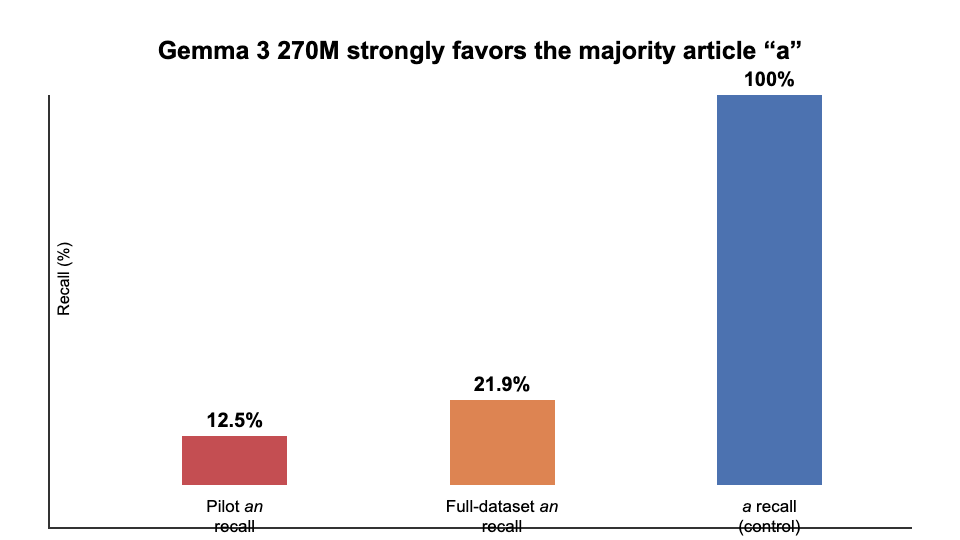
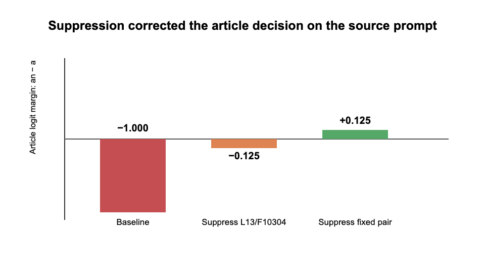
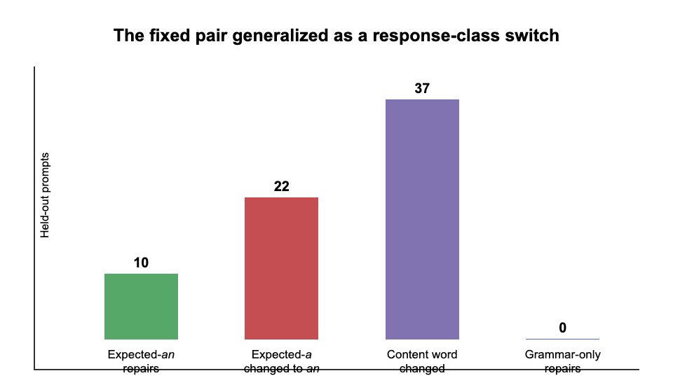

# From “Stalling” to Coordinated Preparation–Content Control in Gemma 3 270M

## Executive summary

This project began with a practical question: can a small language model’s tendency to emit a bridge or “stall” token be causally reduced, allowing it to commit earlier to an answer it already represents? We used Gemma 3 270M because it can be studied on a 16 GB Apple M1 with Circuit Tracer. Our standard was deliberately high. Moving one desired output logit on one prompt would only validate the intervention tool. A meaningful result would require a reusable intervention that transfers across prompts without injecting a specific answer or broadly damaging language behavior.

The work proceeded in two phases.

First, country–city prompts tested the original stalling idea. On `The city people most strongly associate with France is`, Gemma ranked `the` first and `Paris` second. Interventions could reverse that ordering, but the effect was not clean: direct suppression of features supporting `the` failed on the source prompt, successful combinations included Paris-associated features, and related interventions moved wrong-country answers and syntax controls. Shared suppression features later produced small cross-country movements, but no combination met the specificity standard. This phase validated the mechanics of feature intervention and exposed the central confound: changing an output token is not the same as isolating a reusable “commitment” mechanism.

Second, we adopted the preparation–content task from *Latent Planning Emerges with Scale*. That paper asks whether a model represents a future content word early enough to choose a preceding grammatical token such as `a` versus `an`. Gemma strongly favored the majority article `a`. On the key prompt `Someone who treats eye diseases is`, it generated the ungrammatical continuation `a ophthalmologist.` Circuit tracing showed that features carrying information about the future word `ophthalmologist` were active before article generation. More importantly, suppressing a separately selected pair of features changed the continuation to `an ophthalmologist.` on the source prompt.

The decisive held-out test changed the interpretation. The same fixed pair repaired 10 expected-`an` cases, but it also changed 22 expected-`a` controls to `an` and changed the first content word on 37 of 107 held-out prompts. Examples included `a pilot` becoming `an aviator`, and `a lawyer` becoming `an attorney`. There were zero cases where the article alone repaired a realized grammatical mismatch while the content word remained fixed. The intervention therefore did not behave like a clean grammar or anti-stalling control. It behaved like a switch between coordinated response classes: `a` plus a consonant-initial noun versus `an` plus a vowel-initial noun.

Our current hypothesis is consequently narrower and more defensible:

> In Gemma 3 270M, some sparse features causally coordinate an early functional token with the lexical class of a later content token. Suppressing those features can switch both preparation and content together, rather than merely correcting grammar around a fixed latent answer.

This does not yet constitute a publishable result. It is a concrete, falsifiable mechanism that contrasts with the content-preserving planning interpretation we initially sought, and it now has a clear replication and validation path.

## A plain-language guide to the methods

This report uses several terms from language modeling and mechanistic interpretability:

- **Token:** a unit of text processed or generated by the model. A token may be a whole word, such as `Paris`, or part of a word, such as ` ophthalm`.
- **Next-token prediction:** given all text so far, the model assigns a score to every token that could come next. Generation normally selects or samples from this distribution, then repeats the process.
- **Logit:** the model's unnormalized score for a possible next token. A larger logit means a token is favored more strongly. Probabilities are obtained by applying a softmax transformation to all logits.
- **Logit margin:** the difference between two logits. For example, `Paris - the` is positive when `Paris` is favored over `the` and negative when `the` is favored.
- **Baseline:** the model's logits or generated continuation with no internal intervention. Every intervention result is interpreted relative to this unchanged run.
- **Transcoder:** the auxiliary sparse model used by Circuit Tracer to decompose the original neural-network activation at each layer into individually addressable features plus reconstruction error. The transcoder does not replace Gemma; it provides the feature coordinates used for attribution and intervention.
- **Feature:** Circuit Tracer represents activity inside a model layer using learned sparse components. A feature is one such component. A label such as `L13/F10304` means feature 10,304 in the transcoder attached to model layer 13. A feature is not assumed to have one human-readable meaning merely because it affects a token.
- **Attribution graph:** a directed graph estimating how input tokens, internal features, and error terms contribute to later features and output logits for one model run. It suggests candidate causal pathways, but attribution alone does not establish causality.
- **Intervention:** a second forward pass in which selected internal feature activations are deliberately changed. In this project, **suppression** sets an activation to zero. We then compare the intervened logits or generated continuation with the unchanged baseline.
- **Final prompt position:** the internal state produced after the model reads the last token of the prompt and immediately before it predicts the next token. Intervening there changes the computation used to select that next token.
- **Demonstration:** a completed example placed before the target prompt to show the desired task format. The model weights are not updated; this is one-shot prompting.
- **Held-out prompt:** a prompt that was not used to discover or select the intervention. Held-out evaluation tests whether one fixed intervention transfers rather than being tailored to its source example.
- **Preselected criterion or intervention:** a rule or feature combination fixed before examining the final aggregate test result. This reduces the risk of presenting whichever choice happened to work by chance.

Whenever this report says that a token was “predicted,” it means that the token had the highest next-token logit unless stated otherwise. Whenever it says that behavior “changed,” it refers to a comparison between the unchanged baseline run and a run with the specified feature activations suppressed.

## 1. Research question and standard of evidence

Autoregressive language models generate one token at a time, but coherent language often requires information about words that have not yet been emitted. An article is a simple example: choosing `a` or `an` depends on the sound at the beginning of the next noun. A model can solve this either by representing the future noun before selecting the article, or by selecting the article first and allowing that choice to constrain the noun.

Our initial “stalling” hypothesis was broader. We proposed that small models may possess answer-relevant representations that are partially concealed by circuits favoring generic bridge tokens such as `the`. If those circuits could be down-regulated, the model might commit directly to the contextually appropriate answer.

We required three properties before treating an intervention as scientifically meaningful:

- **Causality:** changing the feature must change model behavior.
- **Transfer:** a fixed intervention must work on prompts not used to select it.
- **Specificity:** it must improve the intended behavior without injecting a particular answer, changing unrelated prompts, or merely exchanging one coherent answer for another.

The third requirement is crucial. If a “Paris” feature raises `Paris` for both France and Germany prompts, the intervention controls content but does not reveal a general commitment mechanism. Likewise, if an article intervention changes both `a pilot` and `an aviator`, it may be controlling a larger response class rather than repairing preparation for a fixed answer.

## 2. Stage I: Can a high-probability bridge token be suppressed?

### Motivation

The first experiments established whether Circuit Tracer could identify and causally manipulate features contributing to competing next-token outputs. The source example was:

`The city people most strongly associate with France is`

Gemma’s top two next-token candidates were:

| Rank | Token | Probability | Logit |
| --- | --- | ---: | ---: |
| 1 | `the` | 0.248 | 18.743 |
| 2 | `Paris` | 0.186 | 18.458 |

The baseline commitment margin was:

$$m = \ell_{\mathrm{Paris}} - \ell_{\mathrm{the}} = -0.284$$

Because `Paris` was already strongly available, `the` was treated as a possible bridge into a longer phrase such as “the city of Paris.” The experiment asked whether suppressing features that positively contributed to `the` would allow `Paris` to win.

### Experiment and result

We built attribution graphs for `the` and `Paris`, then tested three intervention families at the final prompt position:

- suppress features supporting `the`;
- amplify features supporting `Paris`;
- combine both operations.

For each family, candidates were selected from features with positive attribution to the relevant output token in the source graph. “Top eight” therefore means the eight highest-ranked candidate features under that graph-based selection rule, not eight features chosen after observing which intervention worked. For every intervention, we reran the same prompt, recorded the new `Paris` and `the` logits, and subtracted the baseline values. This produced the reported change in each logit and in the `Paris - the` margin.

The best combination changed the margin by +1.175, making `Paris` rank first. Most of this movement came from reducing the `the` logit by 1.340, while the `Paris` logit itself fell slightly by 0.166.

This demonstrated causal control of the output competition, but not the hypothesized mechanism. Pure suppression of `the`-supporting features did not work: suppressing the top eight made the margin worse by 0.672. The successful intervention also used Paris-associated features, creating an obvious answer-injection confound.

### Why the next stage was necessary

An intervention selected on France and evaluated only on France cannot distinguish a reusable commitment feature from a Paris-specific feature or a broad change in answer format. We therefore moved to multiple countries and explicit controls.

## 3. Stage II: Cross-country transfer and the specificity problem

### Motivation

The next experiments used prompts for France, Germany, Spain, and Italy, with expected answers such as `Paris`, `Berlin`, `Madrid`, and `Rome`. Prompt families included direct capitals, near matches, and country-specific association prompts. We compared each expected city with the competing token `the`.

The core test was asymmetric:

- A useful commitment intervention should increase the correct city relative to `the` across countries.
- A Paris-inducing intervention should fail because it would also raise Paris on Germany, Spain, or Italy prompts.
- A broad syntax intervention should fail because it would move non-geographic controls.

### Experiment and result

Country-specific interventions often produced strong movement on the prompt used to select them. When transferred, however, they also produced wrong-city movement. This “cross-country pollution” prevented the strong claim that the features were disentangled from city semantics.

“Wrong-city movement” means that an intervention increased, or insufficiently separated itself from, the logit of a city that was not the correct answer for that prompt. For example, a France-derived intervention that favors `Paris` on a Germany prompt is not evidence of general commitment, even if it also lowers `the`.

We then searched for feature identifiers appearing among the `the`-supporting candidates in attribution graphs from multiple countries. Two individual candidates, `L7/F89` and `L10/F9037`, showed weak directional promise when suppressed. Each was first tested alone. We then suppressed both activations in the same forward pass to test whether their effects combined. This pair experiment did not mean that one feature was applied to France and the other to Germany; the identical pair was applied to every evaluated prompt.

The pair was interesting because it was fixed across cases and used suppression only. Nevertheless, the aggregate result did not meet the success criteria set before reviewing the combined results: effects were small or inconsistent, some expected-city logits fell, wrong-city logits moved, and syntax controls were not cleanly separated. The country stage therefore ended as a negative mechanistic result.

### What this stage established

It established a reusable experimental discipline:

$$\text{specificity} = \Delta \ell_{\mathrm{expected}} - \max(\Delta \ell_{\mathrm{wrong\ answer}})$$

A next-token margin can improve even when the expected answer becomes less likely, provided the competitor falls faster. We therefore stopped treating margin improvement alone as evidence of useful commitment. This lesson directly shaped the later held-out tests.

## 4. Connection to *Latent Planning Emerges with Scale*

### The nearest experiment in the paper

*Latent Planning Emerges with Scale* studies cases where an earlier “preparatory” token depends on later content. Its `a/an` occupation task uses prompts of the form:

`Someone who treats eye diseases is`

The model must choose an article before emitting an occupation. If it plans `ophthalmologist`, the grammatically appropriate preparation is `an`.

The paper reports that latent planning becomes more evident with scale: larger models more reliably encode and use future-content information when selecting earlier functional tokens, while smaller models often default to a majority-class preparation. The paper’s core mechanistic question is whether future content is represented before it is generated and whether that representation contributes to the preparatory token.

### Our extension

Our hardware prevents a scale study, but Circuit Tracer gives us a complementary causal question on one small model:

> When a small model represents the future answer but nevertheless emits the wrong preparation, is the plan absent, ignored, or overridden by another pathway that can be causally suppressed?

This contrasts with a simple scale conclusion. Rather than asking only whether planning strength increases with model size, we ask whether an apparently unsuccessful small-model plan can be exposed by intervention.

## 5. Stage III: Behavioral replication of the article imbalance

### Motivation

Before tracing circuits, we needed to verify that Gemma 3 270M occupies a behaviorally relevant regime. If it always used correct grammar, there would be no failure to explain. If it selected `a` but then changed to a consonant-initial noun, the behavior could reflect coherent article-led generation rather than a concealed plan.

Each target was evaluated after two one-shot demonstrations:

- `a` demonstration: `Someone who studies living organisms is a biologist.`
- `an` demonstration: `Someone who studies ancient objects and sites is an archaeologist.`

For example:

`Someone who studies living organisms is a biologist. Someone who handles financial records is`

and

`Someone who studies ancient objects and sites is an archaeologist. Someone who handles financial records is`

The immediate next-token probabilities of `a` and `an` were measured.

### Result

The pilot contained 32 target prompts: 20 whose listed occupation required `a` and 12 whose listed occupation required `an`. Every target was run twice, once after each demonstration. This produced 20 × 2 = 40 expected-`a` evaluations and 12 × 2 = 24 expected-`an` evaluations.

Here **article recall** means:

$$\text{article recall} = \frac{\text{number of evaluations where the highest-logit article was the expected article}}{\text{number of evaluations requiring that article}}$$

For all 40 expected-`a` evaluations, `a` had the higher next-token logit, so expected-`a` recall was 40/40, or 100%. For only 3 of the 24 expected-`an` evaluations, `an` had the higher logit, so expected-`an` recall was 3/24, or 12.5%. No third token outranked both articles in these evaluations.

Separating the expected-`an` cases by preceding demonstration shows that the example had only a modest effect. After the `a` demonstration, `an` won 1 of 12 cases, or 8.3%. After the `an` demonstration, it won 2 of 12, or 16.7%. Gemma therefore showed a substantial majority-class bias, although not complete collapse.

This was only a behavioral prerequisite. It did not show that Gemma intended the listed word. For example, after `Someone who handles financial records is`, Gemma generated `a financial analyst`, not `a accountant`. The article and chosen noun were grammatically coherent.

### Why continuation screening was necessary

To motivate a concealed-plan analysis, we needed cases where the model selected the wrong article and nevertheless continued with a vowel-initial noun. We therefore generated the continuation rather than inferring the future answer from the dataset label.

## 6. Stage IV: Finding genuine preparation–content mismatches

### Pilot continuation result

Across 24 expected-`an` pilot evaluations, only one unique target produced a mismatch under both demonstrations:

| Prompt | Demonstration | Generated continuation |
| --- | --- | --- |
| `Someone who examines eyes and prescribes corrective lenses is` | `a` example | `a ophthalmologist.` |
| same prompt | `an` example | `a ophthalmologist.` |

The model did not generate the listed target `optometrist`; it generated the semantically appropriate alternative `ophthalmologist`. This distinction matters. The future content used for mechanistic analysis must be the model’s actual continuation, not the dataset’s expected label.

A **mismatch** was counted only when the model's own generated article was `a` and the first generated lexical word began with a vowel sound, making the realized phrase ungrammatical. Merely predicting `a` for a dataset row labeled with a vowel-initial occupation did not count if the model then chose a different, consonant-initial occupation. For example, `a financial analyst` is grammatical and was not counted as a mismatch even when the dataset listed `accountant`.

### Full released-dataset screen

We then screened all 105 `an` targets from the paper’s released `a_an_examples.csv`, evaluating each after both demonstrations. This produced 105 × 2 = 210 evaluations. In 46 of those 210 evaluations, `an` had the higher next-token logit, giving `an` recall of 46/210, or 21.9%. We generated a continuation for every case rather than stopping at the article. We found three mismatch rows representing two unique targets:

- `Someone who treats eye diseases is` → `a ophthalmologist.` under both demonstrations;
- `Someone who studies stars and planets is` → `a astronomer.` under the `an` demonstration.

Before running the full screen, we set a threshold of ten distinct mismatch concepts as the minimum needed to justify a broad multi-example mechanistic study. The two observed concepts fell below that threshold. The scarcity is itself important: Gemma usually preserves grammatical coherence by changing the noun after choosing `a`. We therefore narrowed the mechanistic pilot to the reproducible ophthalmologist case instead of generalizing from a large behavioral set that did not exist.

## 7. Stage V: Does future-answer information exist before the wrong article?

### Motivation

The string `a ophthalmologist` does not by itself prove planning. The model might select `a` first and only later choose `ophthalmologist`. To establish a latent plan, information associated with the future content must be present before article generation and must causally contribute to both the article decision and the eventual noun. In this report, “future-answer information” therefore does not mean that a feature has been given the semantic label “ophthalmologist.” It means that the feature is active before the article and has measured attribution to the later ` ophthalm` output, followed by a causal suppression test.

The mechanistic prompt was:

`Someone who studies living organisms is a biologist. Someone who treats eye diseases is`

At baseline, the article logits were:

$$\ell_{\mathrm{an}} - \ell_{\mathrm{a}} = -1.000$$

After forcing `a`, the token ` ophthalm` was the top continuation, with probability 0.1459. “Forcing `a`” means appending the token `a` to the prompt regardless of which article the model preferred, then measuring the distribution for the following token. This lets us ask what content the model would emit along the observed `a` branch.

### Experiment

We first built an attribution graph ending at the article decision and identified features active at the final prompt position. We also evaluated their relationship to the later ` ophthalm` token. We screened for features that contributed to:

- the future token ` ophthalm`;
- the preparatory article logits;
- the eventual ` ophthalm` token after the article.

For each candidate, suppression set that one activation to zero at the final prompt position while leaving all other feature activations unchanged. We then recomputed the article logits. In a corresponding continuation run, we measured the effect on ` ophthalm` after the article. Comparing these runs with baseline tests whether the candidate is causally relevant; the attribution graph alone only nominated the candidate.

### Result

Four features showed a **dual effect**: when each feature was suppressed independently, both the losing `an` preparation and the future ` ophthalm` token became less favored. The strongest, `L13/F10231`, changed the `an` logit by −1.125 and the ` ophthalm` logit by −0.250, while leaving the `a` logit unchanged. Negative values mean that suppression lowered the named token's logit relative to its unchanged baseline.

This is evidence that future-answer information was present before article generation and contributed to the correct article pathway, even though that pathway lost at baseline. It supports the “latent plan exists” premise. It does not improve behavior; suppressing this feature makes the correct preparation weaker.

### Why another selection method was necessary

To correct behavior, we needed features supporting the competing incorrect pathway rather than features carrying the future answer. We therefore selected features that favored `a` over `an` but had low direct attribution to ` ophthalm`. This separation was designed to avoid simply suppressing the answer itself.

## 8. Stage VI: Correcting the source prompt by suppressing a competing pathway

### Experiment

Candidate features were ranked by how strongly the attribution graph indicated that they favored the incorrect article `a` over `an`. We excluded candidates with a large direct attribution to ` ophthalm`, because suppressing such a feature could simply erase the answer. No future-answer feature was amplified. The strongest remaining individual candidate was `L13/F10304`.

Suppressing `L13/F10304` alone improved the article margin from −1.000 to −0.125: `a` still won, but only narrowly. We then tested combinations selected from the five strongest screened candidates. The key preselected two-feature intervention combined `L13/F10304` with `L14/F1949`. “Suppressing the pair” means setting both feature activations to zero simultaneously in the same forward pass. Suppressing both:

- reduced the `a` logit by 0.125;
- increased the `an` logit by 1.000;
- improved the margin by 1.125, from −1.000 to +0.125;
- left the ` ophthalm` logit unchanged;
- changed greedy generation from `a ophthalmologist.` to `an ophthalmologist.`

This was the strongest source-prompt result in the project. It matched the expected signature of removing a competing grammatical pathway while preserving the represented future answer. However, selection and evaluation on one prompt cannot establish that interpretation.

## 9. Stage VII: The held-out test that changed the hypothesis

### Motivation

The decisive question was whether the exact same intervention could be handed to another researcher and applied without rediscovering features for each prompt. We froze the pair `L13/F10304 + L14/F1949`, excluded the source ophthalmologist sentence, and applied it at the final prompt position to 107 other occupation prompts from the released dataset. There was no per-prompt feature selection or adjustment after seeing an output. Of these held-out prompts, 21 had listed answers requiring `an`, while 86 required `a`.

The intended result was content-preserving transfer:

$$\text{wrong article + same noun} \rightarrow \text{correct article + same noun}$$

Expected-`a` prompts served as controls. A clean anti-stalling or grammar intervention should not broadly turn them into `an` responses.

### Result

For this table, an expected-`an` **repair** means that the generated article changed from baseline `a` to intervened `an`. An expected-`a` **control change** means that a prompt whose baseline generated article was `a` generated `an` after intervention. A **content-word change** means that the first lexical word after the article differed between baseline and intervention. A **grammar-only repair** requires the article to become grammatical while that content word remains unchanged.

The fixed pair caused:

| Outcome | Count |
| --- | ---: |
| Expected-`an` prompts repaired | 10 |
| Expected-`an` regressions | 0 |
| Expected-`a` controls changed to generated `an` | 22 |
| First content word changed | 37 |
| Realized grammar-only repairs with content preserved | 0 |

Concrete examples make the mechanism clearer:

| Prompt meaning | Baseline | Fixed-pair suppression |
| --- | --- | --- |
| flies airplanes | `a pilot` | `an aviator` |
| represents clients in legal matters | `a lawyer` | `an attorney` |
| studies matter and energy | `a physicist` | `an astronomer` |

The 10 expected-`an` repairs are therefore not sufficient evidence of success. The same intervention changed 22 of 86 expected-`a` controls to `an`, and it changed the first content word in 37 of all 107 prompts. These outputs remain locally grammatical because article and noun move together. The intervention does not simply raise `an`; it shifts the lexical continuation toward a vowel-initial alternative compatible with `an`. Exact listed-word completions, meaning continuations whose first content word matched the occupation supplied by the dataset, fell from 53 before intervention to 44 after intervention.

### Interpretation

The source correction was real, but its original interpretation did not generalize. We did not isolate a feature pair that reveals a fixed hidden answer by suppressing grammar or stalling. We found a pair that causally influences a coordinated preparation–content choice.

This result runs alongside, rather than directly contradicting, *Latent Planning Emerges with Scale*. The paper shows that future content can influence earlier preparation and that this behavior changes with scale. Our result suggests that, in a very small model, the causal organization may not decompose into a stable future answer plus an independently adjustable preparation. Instead, sparse features can select between coupled response trajectories.

## 10. Current hypothesis and required next experiment

### Revised hypothesis

In Gemma 3 270M, `a/an` preparation and the initial-sound class of the following occupation are partly controlled by shared sparse features. Here the relevant classes are consonant-initial words that normally follow `a` and vowel-initial words that normally follow `an`. These features choose among coordinated response classes rather than independently controlling grammar around a fixed semantic plan.

### Predictions

A positive result should satisfy all of the following:

- The fixed pair should shift probability mass from consonant-initial to vowel-initial noun continuations even when no single article token is forced.
- The same direction should appear across paraphrases and demonstrations.
- A pathway analysis should determine whether the feature pair changes the article through intermediate features representing the future content class, or whether it sends separate effects to both article and content. This is the causal-mediation question: which downstream path carries the intervention's effect?
- Semantically matched noun pairs should reveal class switching while preserving occupation meaning, as in `pilot` versus `aviator`.
- Random features, alternative token positions, unrelated syntactic tasks, and activation-matched controls should not reproduce the effect. An activation-matched control is a feature with a similar baseline activation magnitude but no hypothesized role, used to test whether zeroing any comparably active feature causes similar disruption.

A negative result would also be informative. If the pair’s effect disappears under paraphrase, it is prompt-template-specific. If many activation-matched pairs produce the same behavior, it is nonspecific disruption. If the article changes without systematic movement in noun-initial class under controlled decoding, the current response-class interpretation is wrong.

### Minimum publishable study

The next study should preregister a held-out dataset of occupation concepts with semantically comparable consonant- and vowel-initial alternatives, run the frozen intervention and controls, and measure:

$$\Delta_{\mathrm{class}} = P(\text{vowel-initial content}\mid\mathrm{do}(f=0)) - P(\text{vowel-initial content})$$

It should separately report article change, semantic preservation, first-content-word change, grammaticality, and exact-answer retention. Mechanistically, it should trace whether the pair connects to a distributed vowel/consonant content-class representation before the article, rather than relying only on output logits.

## 11. What has and has not been achieved

We have achieved:

- a reproducible, memory-safe Circuit Tracer workflow for Gemma 3 270M on constrained hardware;
- behavioral replication of a strong minority-class `an` disadvantage;
- direct evidence that future-answer information is active before an incorrect article in the ophthalmologist case;
- a suppression-only intervention that corrects that source continuation without directly reducing ` ophthalm`;
- a held-out test showing that the same intervention broadly coordinates article and lexical choice.

We have not achieved:

- a general tool for reducing stalling behavior;
- a content-preserving grammar correction that transfers across prompts;
- evidence that the country–city `the` token reflects one reusable stalling circuit;
- enough independent feature pairs, prompt families, seeds, and controls for publication.

The main scientific progress is not that we proved the original hypothesis. It is that increasingly stringent transfer and specificity tests rejected its simplest form and exposed a more precise causal phenomenon: coordinated control of preparation and future-content class in a very small language model.

## Reproducibility map

The reports and machine-readable outputs are organized by experiment:

| Stage | Repository directory |
| --- | --- |
| France `the` versus `Paris` source screen | `experiments/stall_commitment_sprint/` |
| Country transfer and wrong-city controls | `experiments/cross_country_commitment_screen/` |
| Shared-feature and pair screens | `experiments/shared_stall_suppression/`, `experiments/paired_shared_feature_suppression/` |
| Article majority baseline | `experiments/a_an_majority_baseline/` |
| Continuation mismatch pilot | `experiments/a_an_continuation_check/` |
| Full released-dataset screen | `experiments/a_an_full_dataset_screen/` |
| Future-answer planning pilot | `experiments/ophthalmologist_planning_pilot/` |
| Competing-pathway source correction | `experiments/ophthalmologist_competing_pathway_screen/` |
| Frozen-pair held-out generalization | `experiments/fixed_pair_generalization/` |

Each directory contains a human-readable `results/report.md`, machine-readable `results/summary.json`, and a `README.md` describing regeneration. The paper-aligned dataset provenance, source commit, prompts, feature IDs, and intervention positions are preserved in those artifacts.
